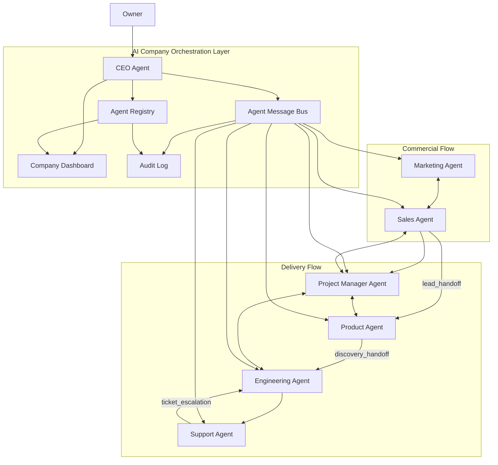
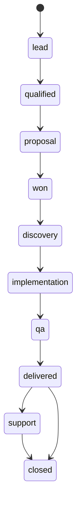
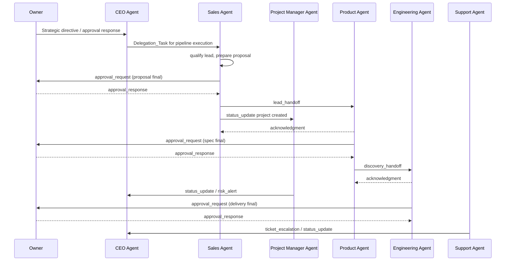

# Design Document

## AI Company Agents

---

## Overview

Fitur ini mendefinisikan desain **AI Company Agents** sebagai lapisan orkestrasi induk untuk seluruh perusahaan AI agency. Dokumen ini tidak menggantikan desain agent individual, tetapi menjadi kontrak lintas agent yang memastikan seluruh alur bisnis bergerak dalam satu sistem yang konsisten dari lead masuk sampai support pasca-delivery.

Spec induk ini menghubungkan tujuh agent operasional:

1. **CEO Agent** — pintu masuk strategis Owner, pengarah prioritas, dan orkestrator delegasi lintas agent
2. **Sales Agent** — pengelola lead, kualifikasi, proposal, dan handoff deal
3. **Marketing Agent** — penghasil demand, messaging, dan feedback pasar
4. **Product Agent** — pengubah konteks bisnis menjadi spesifikasi delivery
5. **Engineering Agent** — pelaksana implementasi dan QA teknis
6. **Project Manager Agent** — penjaga timeline, milestone, blocker, dan status lintas fungsi
7. **Support Agent** — pengelola support ticket dan eskalasi pasca-delivery

**Prinsip desain utama:**
- Spec induk menjadi sumber kebenaran untuk lifecycle, handoff, approval, dan komunikasi lintas agent
- Setiap agent individual tetap memiliki otonomi implementasi internal, tetapi harus mematuhi kontrak induk
- Semua transisi bisnis dan proyek harus tercermin di `Company_Dashboard` dan `Agent_Registry`
- Owner hanya masuk pada `Approval_Gate` penting, sementara koordinasi operasional harian ditangani CEO Agent
- Semua komunikasi penting lintas agent menggunakan `Agent_Message` yang tervalidasi dan dapat diaudit

---

## Architecture

### System Architecture Diagram



### Lifecycle State Flow



### Cross-Agent Handoff Flow



---

## Components and Interfaces

### 1. CEO Agent as Orchestrator

CEO Agent menjadi penghubung utama antara Owner dan sistem. Ia tidak mengambil alih kerja detail setiap agent, tetapi:

- menerima arahan strategis Owner
- memecah objective menjadi `Delegation_Task`
- memilih target agent berdasarkan `Agent_Registry`
- memantau `Company_Dashboard`
- memutuskan konflik prioritas operasional sebelum eskalasi ke Owner

Spec detailnya berada di [ceo-agent requirements](/home/rny/work/2026/05-mei/agentai01/.kiro/specs/ceo-agent/requirements.md) dan harus kompatibel dengan desain induk ini.

### 2. Sales-to-Delivery Pipeline

Sales Agent menjadi pintu masuk komersial utama sampai deal `won`. Setelah itu, pipeline delivery dimulai melalui handoff formal:

- `lead` -> `qualified` -> `proposal` -> `won` dikelola Sales Agent
- `won` memicu pembentukan `project_id` dan registrasi proyek di `Agent_Registry`
- Sales Agent mengirim `lead_handoff` ke Product Agent
- Project Manager Agent mencatat milestone pembentukan proyek dan acknowledgment handoff
- Product Agent menjalankan `discovery`
- Product Agent mengirim `discovery_handoff` ke Engineering Agent setelah `Approval_Gate` spec final

Spec detail sales berada di [sales-agent requirements](/home/rny/work/2026/05-mei/agentai01/.kiro/specs/sales-agent/requirements.md).

### 3. Company Dashboard

`Company_Dashboard` adalah view terpadu untuk Owner dan CEO Agent. Dashboard menggabungkan:

- status agent (`idle`, `busy`, `offline`, `error`, `stale`)
- pipeline lead
- proyek aktif dan `Lifecycle_State`
- approval yang menunggu keputusan Owner
- blocker delivery
- tiket support terbuka
- KPI inti perusahaan

Dashboard bukan sumber kebenaran primer; ia membaca state dari `Agent_Registry` dan log komunikasi yang tervalidasi.

### 4. Agent Registry

`Agent_Registry` adalah state center yang menyimpan data agent, proyek, hak akses konteks, dan histori state. Registry memvalidasi:

- identitas agent pengirim dan penerima
- akses terhadap `project_id`
- kelengkapan field wajib pada `Agent_Message`
- transisi lifecycle yang sah

Representasi minimum:

```ts
type AgentRegistryState = {
  agents: Record<string, {
    agent_id: string
    agent_type: string
    status: "idle" | "busy" | "offline" | "error" | "stale"
    current_project_id?: string
    last_activity_timestamp: string
  }>
  projects: Record<string, {
    project_id: string
    client_id: string
    lifecycle_state: "lead" | "qualified" | "proposal" | "won" | "discovery" | "implementation" | "qa" | "delivered" | "support" | "closed"
    active_agent_ids: string[]
    current_milestone: string
    updated_at: string
  }>
}
```

### 5. Agent Message Contract

Semua komunikasi penting lintas agent menggunakan format `Agent_Message` berikut:

```json
{
  "from": "sales-agent",
  "to": "product-agent",
  "message_type": "lead_handoff",
  "project_id": "proj-123",
  "timestamp": "2026-05-14T09:30:00Z",
  "payload": {}
}
```

`message_type` minimum yang harus didukung:

- `lead_handoff`
- `discovery_handoff`
- `implementation_handoff`
- `status_update`
- `clarification_request`
- `clarification_response`
- `approval_request`
- `approval_response`
- `ticket_escalation`
- `risk_alert`

### 6. Approval Gate Model

`Approval_Gate` berada pada titik berikut:

1. proposal final sebelum dikirim ke klien
2. spec final sebelum implementasi dimulai
3. delivery final sebelum diserahkan ke klien
4. keputusan strategis lintas proyek berdampak tinggi

Setiap approval request wajib membawa:

- ringkasan keputusan
- rekomendasi
- risiko utama
- opsi `approve`, `reject`, atau `revise`
- referensi artefak yang sedang diajukan

### 7. Project Namespace and Isolation

Seluruh artefak klien disimpan dalam namespace:

```text
projects/{client_id}/{project_id}/
```

Aturan isolasi:

- agent hanya boleh mengakses proyek yang menjadi konteks aktifnya
- pesan lintas agent harus lolos validasi akses di `Agent_Registry`
- dashboard hanya menampilkan agregasi, bukan membuka artefak lintas proyek tanpa hak akses

---

## Data Model

### Lifecycle Mapping

| Business / Pipeline Event | Global Lifecycle_State | Primary Owner |
|---------------------------|------------------------|---------------|
| Lead created | `lead` | Sales Agent |
| Lead qualified | `qualified` | Sales Agent |
| Proposal sent | `proposal` | Sales Agent |
| Deal won | `won` | Sales Agent |
| Discovery started | `discovery` | Product Agent |
| Build started | `implementation` | Engineering Agent |
| Final validation | `qa` | Engineering Agent + PM |
| Final delivery approved | `delivered` | Engineering Agent + Owner |
| Post-delivery issue/request | `support` | Support Agent |
| Support closed | `closed` | Support Agent |

### Handoff Artifact Minimum

| Handoff | Sender | Receiver | Required Artifacts |
|--------|--------|----------|--------------------|
| `lead_handoff` | Sales Agent | Product Agent | business summary, stakeholders, conversation notes, last proposal, initial scope, commercial assumptions, risks |
| Project registration | Sales Agent | Project Manager Agent | `lead_id`, `project_id`, client metadata, proposal summary, target timeline |
| `discovery_handoff` | Product Agent | Engineering Agent | final spec, discovery notes, feature priorities, constraints, technical risks |
| `ticket_escalation` | Support Agent | Engineering Agent / PM / CEO | ticket context, impact, urgency, reproduction notes, linked project |

---

## Operational Flows

### Flow 1: Lead to Delivery

1. Marketing Agent atau Owner menghasilkan lead baru untuk Sales Agent.
2. Sales Agent menyimpan lead, memberi skor, dan menggerakkan pipeline sampai `qualified`.
3. Sales Agent menyiapkan proposal dan mengajukan `Approval_Gate` proposal ke Owner.
4. Setelah proposal disetujui dan deal `won`, Sales Agent membuat `project_id` dan mengirim `lead_handoff`.
5. Product Agent mengonfirmasi handoff, memulai `discovery`, dan menyusun spec.
6. Product Agent mengajukan `Approval_Gate` spec final ke Owner.
7. Setelah spec disetujui, Product Agent mengirim `discovery_handoff` ke Engineering Agent.
8. Engineering Agent mengeksekusi implementasi, lalu memindahkan proyek ke `qa`.
9. Setelah delivery final disetujui Owner, proyek berpindah ke `delivered`, lalu `support` bila ada kebutuhan pasca-delivery.

### Flow 2: Dashboard and Escalation

1. Agent memperbarui status atau mengirim `Agent_Message`.
2. `Agent_Registry` memvalidasi dan menyimpan state baru.
3. `Company_Dashboard` menarik snapshot terkini.
4. Jika ada `offline`, `error`, `stale`, atau `risk_alert`, CEO Agent menerima notifikasi operasional.
5. CEO Agent memutuskan apakah perlu redelegasi, penyesuaian prioritas, atau eskalasi ke Owner.

---

## Spec Relationships

- Orkestrasi strategis, dashboard, registry, dan delegasi dirinci di [ceo-agent design](/home/rny/work/2026/05-mei/agentai01/.kiro/specs/ceo-agent/design.md)
- Pipeline penjualan, proposal, lifecycle sales, dan `lead_handoff` dirinci di [sales-agent design](/home/rny/work/2026/05-mei/agentai01/.kiro/specs/sales-agent/design.md)
- Discovery dan `discovery_handoff` berada pada spec Product Agent
- Tracking milestone lintas fungsi berada pada spec Project Manager Agent

Dokumen turunan wajib menjaga kompatibilitas dengan lifecycle, `Agent_Message`, `Approval_Gate`, `Company_Dashboard`, dan `Agent_Registry` yang didefinisikan di sini.
