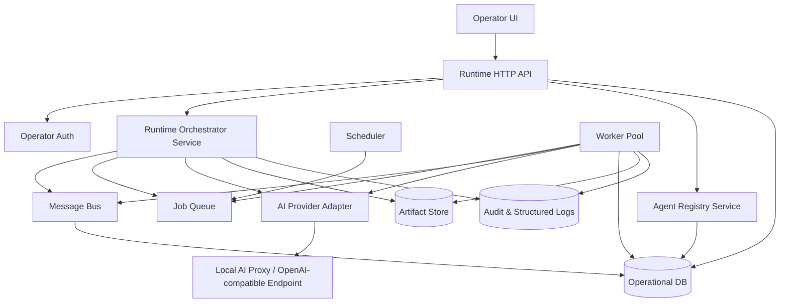
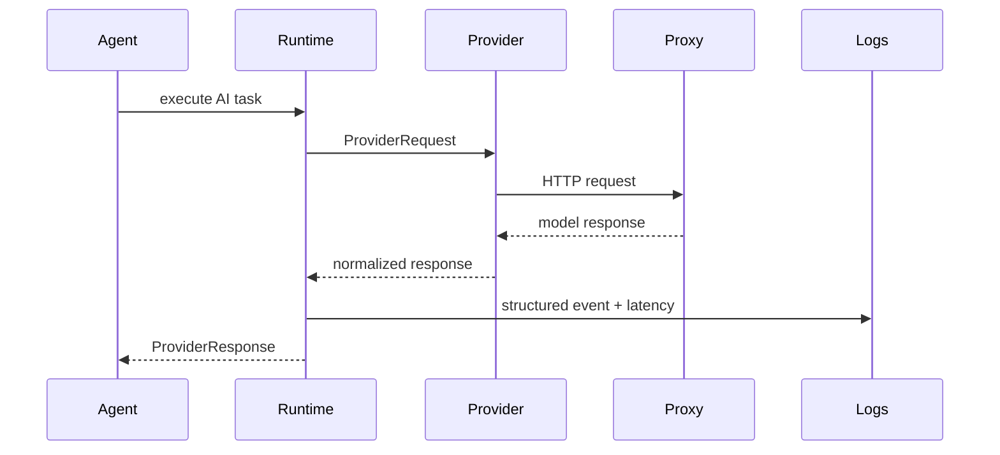
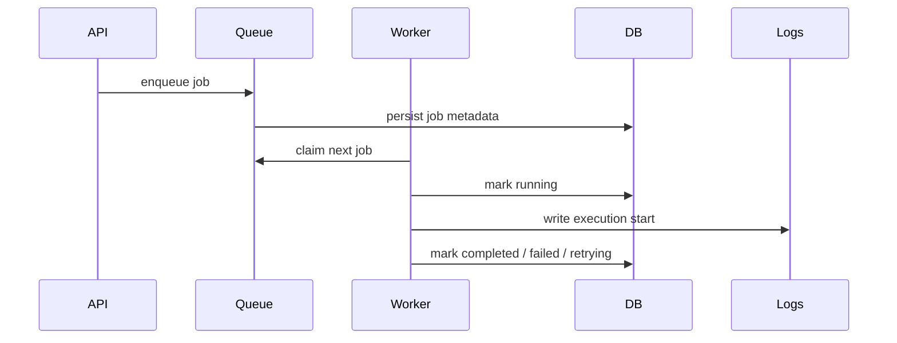
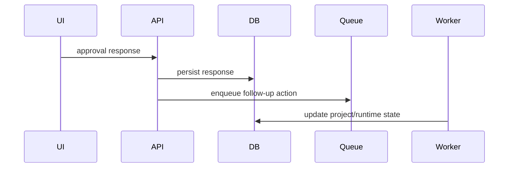

# Design Document

## AI Company Runtime Platform

---

## Overview

Fitur ini mendesain lapisan aplikasi nyata yang menjalankan seluruh ekosistem agent perusahaan. Fokusnya bukan lagi pada kontrak domain atau helper per agent, melainkan pada bagaimana seluruh agent benar-benar di-boot, dijalankan, dipersist, dihubungkan ke provider AI, dan dipantau lewat server/API/UI.

Runtime platform akan menjadi lapisan di atas fondasi yang sudah ada:

- `src/domain/*`
- `src/registry/*`
- `src/app/*`
- `src/runtime/*`
- `src/agents/*`

Prinsip desain utama:

- domain logic tetap reusable dan tidak dicampur dengan concern infrastructure
- AI provider diisolasi di adapter layer
- persistence, queue, scheduler, dan worker dirancang sebagai infrastructure service
- operator UI membaca state dari API runtime, bukan langsung dari domain objects
- semua jalur penting dapat diaudit dan direcover setelah restart

---

## Architecture

### High-Level Runtime Architecture



### Runtime Layers

```text
1. Presentation Layer
   - Operator UI
   - HTTP API

2. Application Layer
   - Runtime Orchestrator Service
   - Approval Service
   - Queue Service
   - Scheduler Service

3. Domain Layer
   - Existing agents, registry, lifecycle, dashboard, message contracts

4. Infrastructure Layer
   - Provider adapter
   - Persistence repositories
   - Queue backend
   - Artifact store
   - Logging/metrics
```

---

## Components and Interfaces

### 1. Runtime HTTP API

Server utama bertugas sebagai entrypoint aplikasi. Endpoint minimum:

```text
GET  /health
GET  /ready
GET  /api/dashboard
GET  /api/agents
GET  /api/projects
GET  /api/projects/:projectId
GET  /api/approvals
POST /api/approvals/:requestId/respond
POST /api/directives
POST /api/messages
GET  /api/runtime/jobs
POST /api/runtime/jobs/:jobId/retry
```

Karakteristik:

- JSON-first
- structured error response
- correlation ID per request
- health dan readiness dibedakan

### 2. AI Provider Adapter

Provider adapter mengabstraksi model AI nyata dari runtime.

Interface minimum:

```ts
type ProviderConfig = {
  baseUrl: string
  apiKey: string
  model: string
  timeoutMs: number
  maxRetries: number
}

type ProviderRequest = {
  systemPrompt?: string
  messages: Array<{ role: "system" | "user" | "assistant"; content: string }>
  temperature?: number
}

type ProviderResponse = {
  model: string
  content: string
  raw: unknown
  latencyMs: number
}
```

Fase awal cukup mendukung OpenAI-compatible API, termasuk local proxy seperti:

```text
AI_BASE_URL=http://127.0.0.1:8045/v1
```

### 3. Runtime Config Loader

Semua config runtime dibaca dari env dan dibekukan di startup.

```ts
type RuntimeConfig = {
  app: {
    port: number
    env: "development" | "test" | "production"
  }
  ai: {
    baseUrl: string
    apiKey: string
    model: string
    timeoutMs: number
  }
  storage: {
    databaseUrl: string
    artifactRoot: string
  }
  queue: {
    concurrency: number
    retryLimit: number
  }
}
```

Startup gagal jika config wajib tidak tersedia.

### 4. Persistence Model

Persistence dibagi menjadi dua domain:

#### Operational DB

Menyimpan:

- agent runtime state
- project registry state
- approval queue
- job queue metadata
- message log
- audit log
- operator action log

#### Artifact Store

Menyimpan:

- spec proyek
- implementation plan
- qa-report
- deliverable package
- support report
- recovery snapshot

Struktur artefak:

```text
artifacts/
  projects/{client_id}/{project_id}/
  runtime/
    recovery/
    logs/
    exports/
```

### 5. Message Bus

Message bus bertugas:

- menerima `Agent_Message`
- validasi kontrak
- validasi hak akses proyek
- menyimpan message log
- meneruskan message ke queue atau handler agent
- mencatat ack, timeout, dan retry

State machine minimum untuk message:

```text
received -> validated -> dispatched -> acknowledged
                     \-> rejected
                     \-> retrying
                     \-> escalated
```

### 6. Job Queue and Scheduler

Queue minimal:

- `message_dispatch`
- `handoff_retry`
- `approval_followup`
- `sla_scan`
- `heartbeat_scan`
- `report_generate`
- `broadcast_timeout_check`

Scheduler periodik:

```text
every 1 min  -> heartbeat scan
every 5 min  -> SLA scan
every 5 min  -> approval backlog scan
every 15 min -> runtime metrics snapshot
daily        -> company report generation
```

### 7. Worker Pool

Workers mengeksekusi queue job dan task agent.

Status worker:

```text
idle
busy
offline
error
recovering
```

Setiap worker harus:

- mengambil job dari queue
- menjalankan handler terkait
- menyimpan progress
- menulis structured log
- menandai job selesai/gagal/retry

### 8. Operator UI

UI minimum terdiri dari:

#### Dashboard Page

- status runtime
- active agents
- active projects
- pending approvals
- failed jobs
- queue depth

#### Projects Page

- list proyek
- lifecycle state
- current milestone
- blockers
- approvals
- artefak utama

#### Runtime Page

- worker status
- scheduler status
- failed jobs
- retry action

#### Messages/Logs Page

- agent message log
- audit log
- correlation ID search

#### Approvals Page

- pending approval list
- detail request
- aksi approve/reject/revise

---

## Data Flow

### 1. Provider Call Flow



### 2. Queue Execution Flow



### 3. Approval Action Flow



---

## Deployment Modes

### Development Mode

- local HTTP server
- `.env.local`
- local filesystem artifact store
- local DB or file-backed store
- local AI proxy

### Production Mode

- process manager or container
- managed DB
- persistent artifact volume/object store
- secured env/secret store
- multiple workers

---

## Risks and Tradeoffs

### 1. Too Much Infrastructure Too Early

Risiko:
- runtime menjadi berat sebelum fitur agent benar-benar dipakai

Mitigasi:
- mulai dengan adapter/repository interfaces
- gunakan backend lokal sederhana dulu

### 2. Provider Lock-In

Risiko:
- logic agent menempel ke satu vendor

Mitigasi:
- semua call AI lewat provider adapter

### 3. Queue and Recovery Complexity

Risiko:
- restart meninggalkan job menggantung

Mitigasi:
- job state persisten
- recovery scan saat startup

### 4. Secret Leakage

Risiko:
- API key bocor di log/UI

Mitigasi:
- masking secret
- config validation dan redaction

---

## Validation Strategy

Runtime platform dianggap siap bila minimal:

1. app dapat dijalankan dengan satu command lokal
2. health dan readiness endpoint berfungsi
3. provider adapter bisa memanggil local proxy
4. state runtime dapat dipersist dan dipulihkan
5. queue dan scheduler mengeksekusi job nyata
6. operator UI dapat melihat dashboard dan approval queue
7. satu skenario end-to-end dapat berjalan melalui app, bukan hanya lewat unit test
