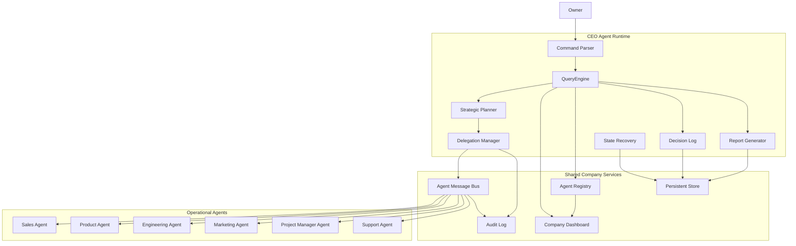
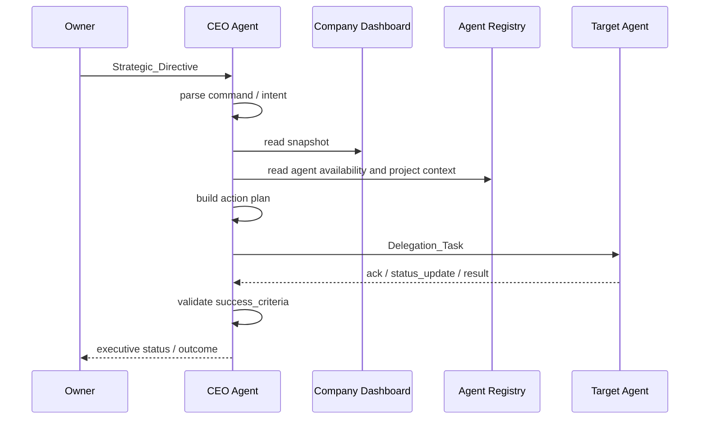
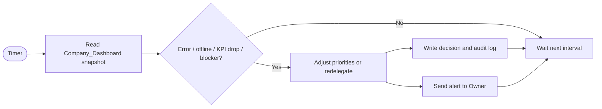

# Design Document

## CEO Agent

---

## Overview

Fitur ini mendefinisikan desain **CEO Agent** sebagai lapisan orkestrasi tertinggi dalam AI Company. CEO Agent menjadi satu pintu koordinasi bagi Owner: menerima arahan strategis, menerjemahkannya menjadi rencana aksi, mendelegasikan pekerjaan ke agent lain, memantau `Company_Dashboard`, membaca `Agent_Registry`, dan memutuskan prioritas operasional lintas proyek.

CEO Agent bukan pelaksana delivery teknis utama. Perannya adalah memastikan sistem bergerak terarah, dependensi antar agent terpenuhi, dan isu penting sampai ke Owner pada waktu yang tepat.

**Prinsip desain utama:**
- CEO Agent menjadi adapter strategis antara Owner dan seluruh agent operasional
- Semua delegasi harus terstruktur sebagai `Delegation_Task`
- Semua keputusan operasional penting harus tercermin di dashboard, registry, dan audit log
- CEO Agent membaca snapshot perusahaan dari `Company_Dashboard`, bukan menarik konteks dari tiap agent secara ad hoc
- CEO Agent harus kompatibel dengan kontrak induk di [ai-company-agents design](/home/rny/work/2026/05-mei/agentai01/.kiro/specs/ai-company-agents/design.md)

---

## Architecture

### System Architecture Diagram



### Strategic Directive Flow



### Dashboard Monitoring Loop



---

## Components and Interfaces

### 1. Command Parser

`Command_Parser` menerima input Owner dalam mode `structured` atau `natural`, lalu mengubahnya menjadi `OwnerCommand` tervalidasi.

```ts
type OwnerCommand = {
  command_type: string
  parameters: Record<string, unknown>
  raw_input: string
  parsed_at: string
}
```

Parser harus:

- mendukung perintah seperti `status`, `history --last N`, `report --type daily`
- mendeteksi ambiguitas yang material
- memunculkan maksimal tiga pertanyaan klarifikasi sebelum eksekusi

### 2. Strategic Planner

`Strategic_Planner` menerjemahkan `OwnerCommand` menjadi rencana aksi eksekusi. Planner menentukan:

- objective utama
- agent yang perlu dilibatkan
- urutan task
- dependency antar task
- estimasi waktu penyelesaian
- risiko dan apakah ada kebutuhan approval

### 3. Delegation Manager

`Delegation_Manager` membuat dan memantau `Delegation_Task`.

```ts
type DelegationTask = {
  task_id: string
  target_agent: string
  instructions: string
  priority: "critical" | "high" | "medium" | "low"
  deadline?: string
  context: Record<string, unknown>
  success_criteria: string[]
  status: "draft" | "delegated" | "completed" | "failed" | "escalated"
}
```

Delegation Manager harus:

- memilih target agent dari `Agent_Registry`
- mengirim task via `Agent_Message`
- menunggu acknowledgment
- memvalidasi hasil terhadap `success_criteria`
- melakukan redelegasi atau eskalasi saat gagal

### 4. Company Dashboard Reader

CEO Agent tidak menyusun status perusahaan dari nol. Ia mengonsumsi `Company_Dashboard` sebagai read model terpadu untuk:

- status agent
- pipeline sales
- proyek aktif
- approval pending
- blocker
- tiket support
- KPI

Dashboard menjadi sumber utama untuk `status`, pelaporan, alert operasional, dan penyesuaian prioritas.

### 5. Agent Registry Reader and Validator

CEO Agent menggunakan `Agent_Registry` untuk:

- membaca `Agent_Roster`
- mengetahui agent yang tersedia / busy / offline
- memetakan project ownership aktif
- memverifikasi bahwa delegasi memakai konteks proyek yang valid
- mendukung keputusan prioritas lintas proyek

Data registry minimum yang sering dibaca CEO:

```json
{
  "agent_id": "sales-agent",
  "agent_type": "sales",
  "status": "busy",
  "current_project_id": "proj-123",
  "last_activity_timestamp": "2026-05-14T09:45:00Z"
}
```

### 6. Decision Log

Semua keputusan penting dicatat sebagai `Strategic_Decision`.

```ts
type StrategicDecision = {
  decision_id: string
  timestamp: string
  context: string
  options_considered: string[]
  chosen_option: string
  rationale: string
  impacted_projects: string[]
}
```

Decision log mendukung audit, historis, dan deteksi konflik directive Owner terhadap keputusan yang masih aktif.

### 7. Report Generator

`Report_Generator` menghasilkan `Company_Report` periodik atau on-demand yang menarik data dari:

- `Company_Dashboard`
- `Delegation_Task` status
- `Strategic_Decision` log
- KPI historis

Laporan minimum memuat:

- proyek aktif
- pipeline lead
- KPI utama
- isu operasional
- approval pending
- rekomendasi tindakan Owner

### 8. State Recovery

CEO Agent harus dapat memulihkan:

- proyek aktif
- delegation yang sedang berjalan
- antrian pesan belum selesai
- schedule monitoring dan report

State recovery membaca persistent store saat startup dan memperbarui heartbeat periodik selama runtime.

---

## Tool Design

CEO Agent mengikuti pola `AgentDefinition`, `buildTool`, `Task`, dan `QueryEngine` dari codebase referensi.

### Tool Inventory

| Tool | Purpose |
|------|---------|
| `agent_delegate` | Mengirim `Delegation_Task` ke agent target |
| `company_dashboard` | Mengambil snapshot dashboard terpadu |
| `decision_make` | Mencatat keputusan strategis dan rationale |
| `report_generate` | Menyusun laporan untuk Owner |
| `priority_set` | Menetapkan atau menyesuaikan prioritas lintas proyek |
| `message_broadcast` | Mengirim instruksi seragam ke beberapa agent |

### Agent Definition Sketch

```ts
const ceoAgentDefinition = {
  agentType: "ceo",
  description: "Strategic orchestrator for AI Company",
  tools: [
    "agent_delegate",
    "company_dashboard",
    "decision_make",
    "report_generate",
    "priority_set",
    "message_broadcast"
  ],
  systemPrompt: "Coordinate the company, delegate work, monitor dashboard, and escalate only when needed."
}
```

### Permission Boundary

Tool yang berdampak luas wajib memakai `checkPermissions`, terutama untuk:

- broadcast ke grup `all`
- perubahan prioritas lintas proyek berdampak tinggi
- keputusan yang memengaruhi approval gate aktif

---

## Operational Flows

### Flow 1: Directive to Delegation

1. Owner mengirim `Strategic_Directive`.
2. `Command_Parser` mengubah input menjadi `OwnerCommand`.
3. CEO Agent membaca `Company_Dashboard` dan `Agent_Registry`.
4. `Strategic_Planner` membangun action plan dan dependency.
5. `Delegation_Manager` membuat satu atau lebih `Delegation_Task`.
6. Agent penerima mengirim acknowledgment dan status update.
7. CEO Agent memvalidasi hasil dan melapor ke Owner.

### Flow 2: Monitoring and Reprioritization

1. CEO Agent membaca dashboard secara periodik.
2. Jika ada blocker, downtime agent, atau KPI drop, CEO Agent mencatat `Strategic_Decision`.
3. CEO Agent dapat menyesuaikan prioritas atau redelegasi task.
4. Jika risiko melewati ambang, CEO Agent mengeskalasi ke Owner dengan ringkasan dan opsi keputusan.

### Flow 3: Coordination with Sales and Delivery

1. CEO Agent memantau pipeline Sales melalui dashboard.
2. Saat ada proposal final yang menunggu approval, CEO Agent memastikan item tersebut terlihat di dashboard.
3. Saat Sales Agent menandai deal `won`, CEO Agent memantau pembentukan proyek, `lead_handoff`, dan acknowledgment Product Agent.
4. Saat Product atau Engineering mengalami blocker lintas fungsi, CEO Agent memutuskan reprioritization atau eskalasi.

---

## Spec Relationships

- Kontrak lifecycle, `Company_Dashboard`, `Agent_Registry`, `Approval_Gate`, dan `Agent_Message` berasal dari [ai-company-agents design](/home/rny/work/2026/05-mei/agentai01/.kiro/specs/ai-company-agents/design.md)
- Pipeline sales, proposal approval, dan `lead_handoff` berada di [sales-agent design](/home/rny/work/2026/05-mei/agentai01/.kiro/specs/sales-agent/design.md)
- CEO Agent harus mengonsumsi state delivery dari Product, Engineering, Project Manager, dan Support tanpa mengambil alih logika domain internal mereka
