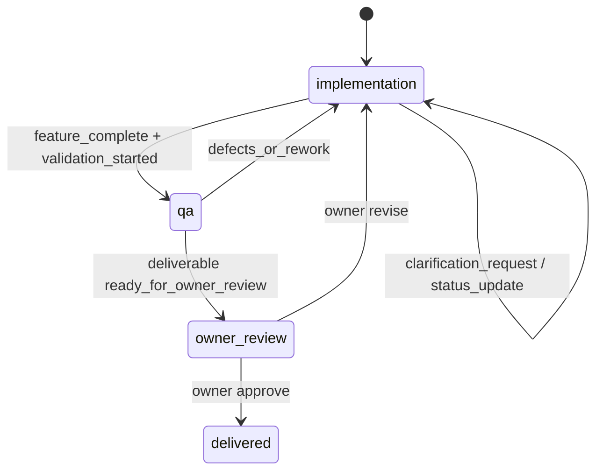
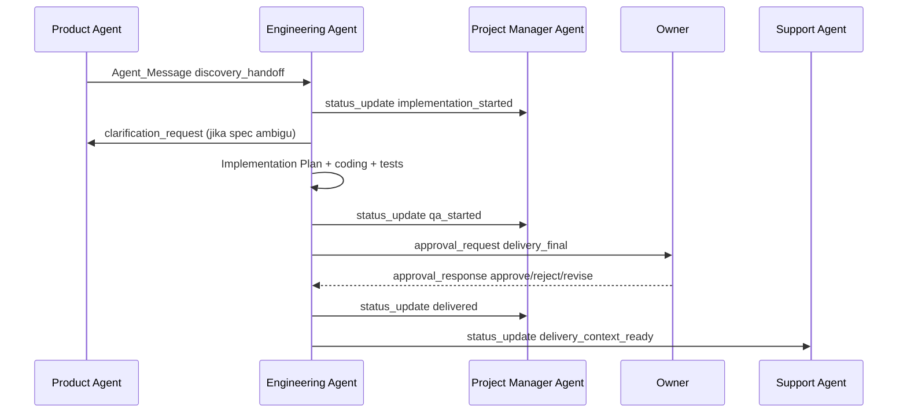

# Design Document

## Engineering Agent

---

## Overview

Dokumen ini mendeskripsikan desain **Engineering Agent** sebagai pelaksana fase `implementation`, `qa`, dan `delivered` dalam AI Company. Desain ini terhubung ke spec induk [ai-company-agents](/home/rny/work/2026/05-mei/agentai01/.kiro/specs/ai-company-agents/requirements.md) dan requirements [engineering-agent/requirements.md](/home/rny/work/2026/05-mei/agentai01/.kiro/specs/engineering-agent/requirements.md).

Engineering Agent menerima `discovery_handoff` yang sudah disetujui Owner, menyusun Implementation Plan, membangun deliverable di workspace terisolasi, menjalankan validasi teknis, mengelola approval gate delivery final, lalu menandai proyek `delivered` setelah persetujuan Owner.

**Prinsip desain utama:**
- Engineering Agent hanya mulai bekerja dari handoff discovery yang valid dan sudah melewati approval gate Spec
- Transisi lifecycle wajib eksplisit: `implementation -> qa -> delivered`
- QA tidak dianggap selesai hanya karena coding selesai; harus ada test evidence dan QA Report
- Semua perubahan yang menyimpang dari Spec harus terdokumentasi dan diberitahukan ke Product Agent atau Owner
- Project Manager Agent dan Support Agent menerima status penting agar delivery dan fase pasca-delivery tetap sinkron

---

## Architecture

### Lifecycle Placement



### Cross-Agent Flow



---

## Components and Interfaces

### 1. Handoff Intake and Validation

Komponen ini menerima `discovery_handoff` dari Product Agent dan memastikan payload memuat Spec final, acceptance criteria, prioritas fitur, daftar tool, batasan proyek, risiko implementasi, dan histori approval Spec.

Jika handoff belum lengkap atau Spec ambigu, Engineering Agent tidak memulai coding. Agent mengirim `clarification_request` ke Product Agent dan memberi tahu Project Manager Agent bahwa proyek tertahan pada tahap intake.

### 2. Implementation Planner

Implementation Planner membentuk `Implementation_Plan` yang memetakan capability dari Spec ke komponen teknis nyata. Isi minimum:

- urutan kerja
- dependensi
- risiko teknis
- output tiap tahap
- strategi test
- kebutuhan integrasi eksternal

Planner juga menjadi dasar update progres ke Project Manager Agent selama fase `implementation`.

### 3. Client Workspace Manager

Seluruh pekerjaan dilakukan pada `Client_Workspace` terisolasi per proyek. Artefak minimum:

- `implementation-plan.md`
- `spec-clarifications.md`
- source code dan konfigurasi
- `qa-report.md`
- `changelog.md`
- `deliverable-v{version}/`

Workspace Manager membatasi akses ke proyek aktif dan menjaga agar artefak tidak menimpa proyek lain.

### 4. Build and Tool Execution Layer

Lapisan ini mengeksekusi pekerjaan teknis menggunakan tool yang disyaratkan pada spec:

- `code_read`
- `code_write`
- `test_run`
- `bash_exec`
- `deliverable_package`
- `message_send`

Eksekusi shell dibatasi pada allowlist perintah dan path workspace proyek. Setiap operasi signifikan dicatat agar bisa dipulihkan setelah restart.

### 5. QA Orchestrator

QA Orchestrator mengubah hasil implementasi menjadi bukti kualitas. Tanggung jawab minimum:

- menjalankan unit test
- menjalankan integration test untuk workflow utama
- menjalankan static checks untuk syntax atau type safety
- mencatat known limitations
- menyusun `QA_Report`

Saat fitur dinyatakan complete dan validasi akhir dimulai, agent mengubah proyek ke state `qa`. Jika ditemukan defect mayor, proyek kembali aktif dikerjakan di `implementation`.

### 6. Delivery Approval Coordinator

Setelah QA lolos, Engineering Agent membuat paket deliverable dan menandai status `ready_for_owner_review`. Approval request ke Owner untuk delivery final harus memuat:

- ringkasan implementasi
- status test dan QA
- known limitations
- instruksi deployment
- perubahan dari versi sebelumnya

Jika Owner memilih `revise`, Engineering Agent membuat revisi baru tanpa menimpa versi deliverable lama. Jika Owner `approve`, barulah lifecycle berubah ke `delivered`.

### 7. Delivery Broadcaster

Setelah final approval, komponen ini mengirim `status_update` ke Project Manager Agent dan Support Agent. Tujuannya:

- Project Manager Agent menutup milestone delivery
- Support Agent menerima konteks awal untuk fase support

Artifact delivery tetap versioned di `{client_id}/{project_id}/deliverable-v{version}/`.

---

## Message Contracts

### Incoming Messages

| `message_type` | From | Purpose |
|---|---|---|
| `discovery_handoff` | Product Agent | Memulai fase implementation |
| `clarification_response` | Product Agent / Owner | Menjawab pertanyaan implementasi |
| `approval_response` | Owner | Menentukan approve/reject/revise delivery |
| `status_update` | Project Manager Agent | Sinkronisasi milestone dan blocker |

### Outgoing Messages

| `message_type` | To | Purpose |
|---|---|---|
| `clarification_request` | Product Agent | Meminta penjelasan tambahan tentang Spec |
| `status_update` | Project Manager Agent | Mengirim progres implementation, qa, dan delivered |
| `approval_request` | Owner | Mengajukan delivery final untuk approval gate |
| `status_update` | Support Agent | Mengirim konteks deliverable yang telah disetujui |
| `risk_alert` | Project Manager Agent / Owner | Mengeskalasi risiko teknis atau keterlambatan |

---

## State and Data Model

### Project State Managed by Engineering Agent

```json
{
  "project_id": "proj_123",
  "client_id": "client_456",
  "lifecycle_state": "implementation",
  "implementation_status": "in_progress",
  "qa_status": "not_started",
  "delivery_version": 1,
  "owner_review_status": "not_requested",
  "updated_at": "2026-05-14T10:30:00Z"
}
```

### Internal Task States

- `handoff_intake`
- `implementation_planning`
- `implementation_in_progress`
- `awaiting_clarification`
- `qa_in_progress`
- `awaiting_owner_delivery_approval`
- `delivery_revision`
- `delivery_completed`

---

## Failure Handling

### Ambiguous or Incomplete Spec

Engineering Agent membuat `clarification_request` ke Product Agent dan menahan coding sampai ambiguity ditutup atau ada keputusan Owner.

### Test Failures

Jika unit test, integration test, atau static checks gagal, QA Orchestrator mencatat akar masalah, mengembalikan state kerja ke `implementation`, dan mengirim `status_update` ke Project Manager Agent bila berdampak ke timeline.

### Delivery Revision Requested by Owner

Respons `revise` membuat versi deliverable baru, memperbarui changelog, dan menjaga versi lama tetap tersedia untuk audit.

### Unrecoverable Execution Error

Jika agent gagal melanjutkan karena error yang tidak dapat dipulihkan, konteks kerja terakhir disimpan, lalu `risk_alert` dikirim ke Project Manager Agent dan Owner.

---

## Coordination Rules

- Engineering Agent wajib mengirim acknowledgment segera setelah `discovery_handoff` valid diterima
- Engineering Agent wajib memberi `status_update` saat masuk `implementation`, saat mulai `qa`, saat `ready_for_owner_review`, dan saat `delivered`
- Product Agent tetap menjadi sumber klarifikasi Spec sampai implementasi stabil, tetapi Project Manager Agent memegang tracking milestone
- Support Agent baru menerima context package setelah Owner menyetujui delivery final
- Approval gate delivery final wajib tampil di dashboard induk sebagai pending decision Owner
