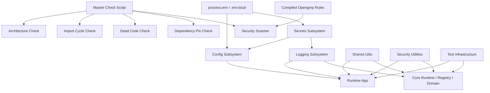
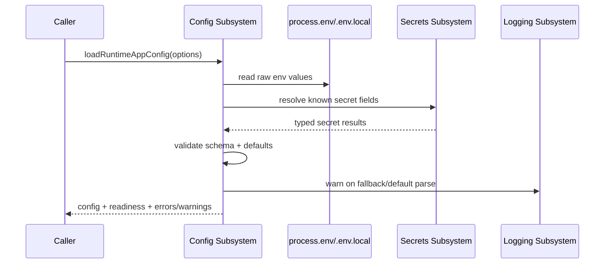
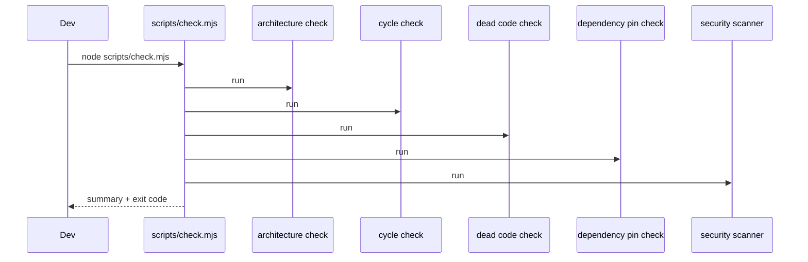

# Design Document

## Foundation Adaptation

---

## Overview

Fitur ini mendesain lapisan fondasi teknis untuk **AI Company Runtime Platform** dengan mengadopsi pola engineering yang relevan dari referensi OpenClaw tanpa menyalin arsitekturnya mentah-mentah. Fokusnya adalah memperkuat area yang selama ini menjadi prasyarat refactor aman dan operasi runtime yang rapi:

1. `src/logging/` untuk structured logging dan secret redaction
2. `src/runtime-app/config/` dan `src/secrets/` untuk config loading, readiness, dan akses secret yang terpusat
3. `src/security/`, `src/shared/`, dan `src/types/` untuk utility fondasi, boundary guard, dan type declarations
4. `scripts/` dan `security/` untuk automation checks serta static analysis
5. `test/` untuk shared test infrastructure dan architecture guardrails

Prinsip desain utama:

- fondasi baru tidak mengubah contract domain di `src/domain/`
- core tetap agent-agnostic; adaptasi fokus ke platform concerns, bukan logic agent
- akses secret, config, dan logging harus lewat entry point yang jelas dan auditable
- validasi arsitektur harus bisa dijalankan ganda: lewat script dan lewat `bun test`
- surface baru harus mudah diadopsi bertahap oleh `src/runtime-app/` tanpa big-bang rewrite

---

## Architecture

### High-Level Foundation Architecture



### Subsystem Placement

```text
src/
  logging/                 structured logger, redaction, correlation helpers
  secrets/                 typed secret accessors and masking
  security/                architecture and security boundary helpers
  shared/                  reusable utils with no business coupling
  types/                   external type declarations
  runtime-app/config/      config schema, loading, readiness, serialization

scripts/
  check.mjs
  check-architecture-smells.mjs
  check-import-cycles.mjs
  check-deadcode-unused-files.mjs
  check-dependency-pins.mjs
  deadcode-unused-files.allowlist.mjs

security/
  opengrep/
    compile-rules.mjs
    precise.yml

test/
  setup.ts
  fixtures/
  helpers/
  mocks/
  architecture-boundaries.test.ts
```

---

## Components and Interfaces

### 1. Logging Subsystem

`src/logging/` menjadi entry point tunggal untuk semua log runtime. Target utamanya menggantikan `console.*` pada production paths dengan structured logger yang:

- menulis JSON line per event
- membawa `timestamp`, `level`, `message`, `correlation_id`, dan `context`
- menerapkan minimum log level berdasarkan environment
- meredaksi secret pada message string maupun nested object

Kontrak minimum:

```ts
type LogLevel = "debug" | "info" | "warn" | "error"

type LogEntry = {
  timestamp: string
  level: LogLevel
  message: string
  correlation_id?: string
  context?: Record<string, unknown>
}

type Logger = {
  debug(message: string, context?: Record<string, unknown>): void
  info(message: string, context?: Record<string, unknown>): void
  warn(message: string, context?: Record<string, unknown>): void
  error(message: string, context?: Record<string, unknown>): void
  child(bindings: { correlation_id?: string; context?: Record<string, unknown> }): Logger
}
```

Redaction bekerja sebelum serialization. Karena platform masih local-first, output default cukup ke stdout/stderr, tetapi consumer tidak tahu detail writer internal karena semua import lewat `src/logging/index.ts`.

### 2. Config Subsystem

`src/runtime-app/config/` menjadi satu-satunya tempat yang:

- membaca `.env.local`
- membaca `process.env`
- menggabungkan precedence
- memvalidasi schema runtime app
- menghitung readiness
- menyediakan serializer yang sudah meredaksi secret

Kontrak minimum:

```ts
type RuntimeAppConfig = {
  app: {
    env: "development" | "test" | "production"
    port: number
  }
  ai: {
    baseUrl: string
    apiKey: string | null
    model: string
    timeoutMs: number
  }
  auth: {
    operatorToken: string | null
    telegramToken: string | null
    allowedChatIds: string[]
  }
  readiness: {
    ready: boolean
    reasons: string[]
  }
}

type ConfigParseResult =
  | { ok: true; config: RuntimeAppConfig; warnings: string[] }
  | { ok: false; errors: Array<{ field: string; message: string }>; warnings: string[] }
```

Mode `test` menerima injected env/secrets agar test tidak bergantung ke host environment.

### 3. Secrets Subsystem

`src/secrets/` memusatkan akses secret agar config, logging, provider, dan auth tidak membaca raw env langsung.

Kontrak minimum:

```ts
type SecretKey = "OPERATOR_TOKEN" | "AI_API_KEY" | "TOKEN_TELE"

type SecretResult =
  | { ok: true; key: SecretKey; value: string }
  | { ok: false; key: SecretKey; reason: "missing" }

type SecretsAccessor = {
  get(key: SecretKey): SecretResult
  getOperatorToken(): SecretResult
  getAiApiKey(): SecretResult
  getTelegramToken(): SecretResult
}
```

Helper `redactSecret(value)` dipakai lintas config serializer, logger, dan UI masking.

### 4. Security Utilities

`src/security/` menyediakan utility non-business untuk enforcement dasar:

- validasi bahwa mutating runtime action memiliki `OPERATOR_TOKEN`
- guard agar raw `process.env` tidak dipakai sembarang
- helper untuk audit payload sebelum dilog
- helper rule metadata validation untuk ruleset static analysis

Security utilities tidak boleh import agent internals atau logic runtime app.

### 5. Shared Utilities

`src/shared/` menjadi tempat untuk helper lintas subsistem yang murni dan deterministic. Kandidat utilitas:

- `assertNever` untuk discriminated unions
- `isRecord` dan narrowers lain
- deterministic ID / correlation ID factory
- deep object walker untuk redaction
- result helpers untuk success/failure typed return

Aturannya ketat: utility di sini tidak boleh menyimpan state global dan tidak boleh punya coupling ke `src/agents/`.

### 6. Type Declarations

`src/types/` menyimpan declaration files untuk dependency eksternal yang dipakai project tetapi tidak memiliki types memadai. Tujuannya menjaga strict TypeScript tetap bersih tanpa `@ts-nocheck` atau `any` yang bocor dari adapter boundary.

### 7. Master Check Script

`scripts/check.mjs` menjadi orchestration entry point untuk seluruh validasi pre-push:

- architecture boundary check
- import cycle detection
- dead code detection
- dependency pin validation
- security scanner execution

Perilaku desain:

- default run menjalankan semua check berurutan
- `--only <name>` menjalankan satu check
- `CI=true` memicu output machine-readable
- summary akhir menampilkan status setiap check dan total durasi

### 8. Architecture Boundary Check

Checker arsitektur membaca graph import di `src/` lalu mengklasifikasikan pelanggaran terhadap rules berikut:

1. `src/agents/*` tidak boleh import internal agent lain
2. `src/runtime-app/providers/` tidak boleh import internal agent
3. `src/security/`, `src/shared/`, `src/secrets/` tidak boleh import business logic dari `src/agents/` atau `src/runtime-app/`

Checker menghasilkan violation record:

```ts
type ArchitectureViolation = {
  file: string
  importPath: string
  ruleId: string
  message: string
}
```

### 9. Import Cycle Detection

Cycle checker membangun adjacency graph untuk file TypeScript di `src/` lalu mencari strongly connected components atau cycle paths. Output menampilkan rantai lengkap agar refactor target jelas.

### 10. Dead Code Detection

Dead code checker menganalisis:

- file `src/` yang tidak direferensikan dan bukan entry point
- exported symbol yang tidak punya consumer

Allowlist dipisah ke `scripts/deadcode-unused-files.allowlist.mjs` agar pengecualian eksplisit dan reviewable.

### 11. Dependency Pin Validation

Checker membaca `package.json` root dan workspace bila ada, lalu menolak version ranges non-exact seperti `^`, `~`, `*`, `latest`, `<`, `>`.

### 12. Security Static Analysis

Scanner lokal dibangun di atas compiled opengrep ruleset `security/opengrep/precise.yml`. Rule categories minimum:

- hardcoded secret
- raw `process.env` access di luar boundary yang diizinkan
- `console.*` yang berisiko mengekspos secret
- mutating HTTP endpoint tanpa validasi `OPERATOR_TOKEN`

Pipeline rules:

```text
source rule YAML -> compile-rules.mjs -> precise.yml -> run-opengrep.sh
```

### 13. Test Infrastructure

Folder `test/` menjadi shared platform untuk semua subsistem fondasi dan runtime app.

Isi minimum:

- `test/setup.ts` untuk set env `test`, seed deterministic IDs, dan silence logger
- `test/fixtures/` untuk sample config, sample message, dan lifecycle samples
- `test/helpers/` untuk factory `createTestConfig`, `createTestMessage`, mock agent/provider helpers
- `test/mocks/` untuk mock provider, mock storage, dan mock secrets

Test infra hanya boleh bergantung pada `src/domain/` dan public subsystem APIs.

### 14. Boundary Tests in Bun

Selain script checker, `test/architecture-boundaries.test.ts` menjalankan rule yang sama lewat `bun test`. Ini menjaga boundary regression tertangkap di loop test biasa, bukan hanya saat pre-push.

### 15. Logging Redaction Tests

`src/logging/redaction.test.ts` memverifikasi properti inti:

- secret tidak muncul verbatim
- redaction idempotent
- nested secret ikut teredaksi
- string non-secret tetap tidak berubah

Walau requirement menyebut property-based behavior, implementasi bisa memakai generated case table deterministik selama coverage pola secret tetap kuat dan eksplisit.

---

## Data Flow

### Config and Secret Resolution Flow



### Validation Workflow



---

## Adoption Strategy

Desain ini diasumsikan diadopsi bertahap, bukan satu commit besar.

### Phase 1: Foundation Introduction

- tambahkan subsistem `logging`, `secrets`, `shared`, `security`, `types`
- tambahkan `test/` skeleton dan `scripts/` validation entry points
- jaga compatibility dengan runtime app yang sudah ada

### Phase 2: Runtime App Migration

- migrasikan `src/runtime-app/` dari raw `console.*` ke logger
- migrasikan raw `process.env` access ke config/secrets subsystem
- tambahkan warning dan readiness flow yang terstruktur

### Phase 3: Guardrail Enforcement

- aktifkan architecture tests
- aktifkan check scripts
- aktifkan security scanner rules dan dependency pin validation

---

## Risks and Mitigations

- Risiko: migrasi `console.*` dan raw env access memecah startup path yang sudah berjalan.
  Mitigasi: sediakan adapter compatibility dan rollout bertahap per entrypoint runtime app.

- Risiko: checker terlalu ketat dan menghasilkan false positive.
  Mitigasi: pisahkan rule config/allowlist, tambah error message deskriptif, dan validasi rule dengan fixture tests.

- Risiko: redaction overreach mengubah data non-secret yang masih diperlukan untuk debug.
  Mitigasi: batasi pola ke key names dan token prefixes yang jelas, lalu uji idempotence serta pass-through untuk non-secret.

- Risiko: test infra mulai mengimpor internal subsistem secara liar.
  Mitigasi: enforce lewat architecture rule yang juga memindai `test/` boundary imports.

---

## Success Criteria

Desain ini dianggap berhasil bila:

- `src/runtime-app/` tidak lagi bergantung pada raw `console.*` dan raw secret exposure
- config dan secret resolution punya contract tunggal yang typed dan testable
- `scripts/check.mjs` menjadi pintu validasi utama sebelum push
- `bun test` ikut menjaga architecture boundary dan redaction safety
- fondasi baru memperkuat maintainability tanpa mengubah agent logic atau domain contract
