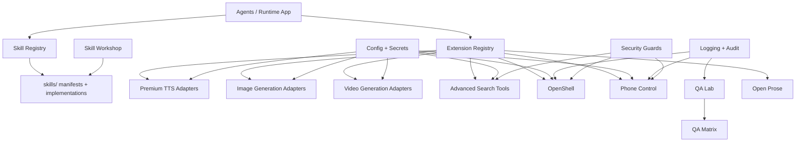
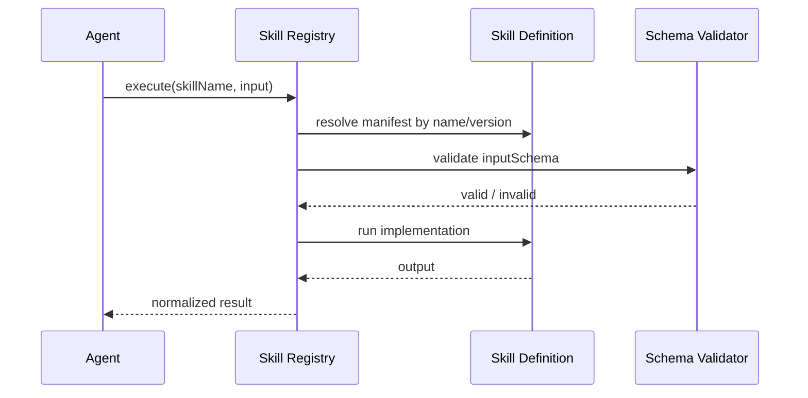
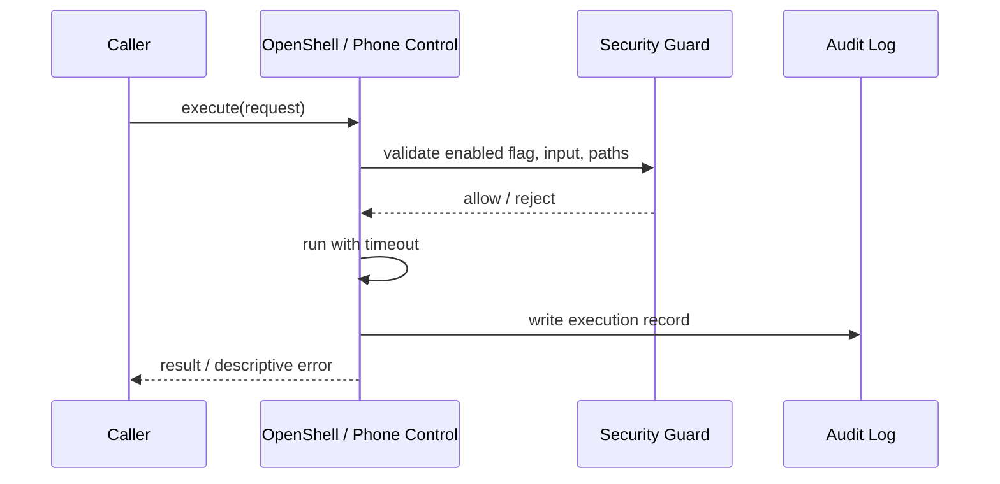

# Design Document

## Low Priority Adaptation

---

## Overview

Fitur ini mendesain tahap ekspansi ekosistem setelah `foundation-adaptation` dan `medium-priority-adaptation` stabil. Fokusnya bukan lagi membangun fondasi inti, tetapi menambahkan kapabilitas lanjutan yang memperkaya platform:

1. `skills/` sebagai reusable skills ecosystem untuk AI-assisted development
2. premium provider adapters untuk speech, image, dan video generation
3. advanced search tools dan operator-facing automation tools berisiko tinggi
4. QA tooling lanjutan untuk lab environments dan matrix execution
5. authoring tools untuk skill development dan long-form prose generation

Prinsip desain utama:

- semua extension wajib duduk di atas contract yang sudah ada; jangan hardcode consumer ke provider tertentu
- fitur level ini default-off bila membawa biaya, privilege, atau security surface besar
- secret, timeout, audit log, dan sandbox boundaries wajib reuse fondasi yang sudah ada
- skill ecosystem dan tool plugins harus testable tanpa runtime penuh
- low-priority items diposisikan sebagai enrichment; runtime utama tetap bisa berjalan sehat tanpa mereka

---

## Architecture

### High-Level Expansion Architecture



### Placement Strategy

```text
skills/
  README.md
  <skill-name>/
    skill.json
    index.ts
    *.test.ts

src/runtime-app/
  skills/                 skill registry and skill execution adapters
  providers/tts/          elevenlabs, azure-speech, microsoft
  providers/image/        fal, comfy
  providers/video/        runway, vydra
  tools/search/           perplexity, firecrawl, searxng
  tools/openshell/        sandboxed shell tool
  tools/phone-control/    mobile automation tool
  tools/open-prose/       long-form generation tool

qa/
  labs/
  lab-runner.mjs
  matrix.mjs

skills/
  workshop.mjs
```

`skills/` dan `qa/` belum ada saat ini, jadi desain ini memperlakukannya sebagai penambahan baru, bukan migrasi dari struktur existing.

---

## Components and Interfaces

### 1. Skills Ecosystem

Skills ecosystem menyediakan artefak reusable yang bisa ditemukan dan dijalankan agent tanpa meletakkan semua logic di prompt atau agent implementation.

Struktur minimum skill:

```json
{
  "name": "brief-summarizer",
  "version": "1.0.0",
  "description": "Summarize a project brief into structured bullets.",
  "deterministic": true,
  "inputSchema": {},
  "outputSchema": {},
  "implementation": "./index.ts"
}
```

Kontrak registry:

```ts
type SkillManifest = {
  name: string
  version: string
  description: string
  deterministic: boolean
  inputSchema: unknown
  outputSchema: unknown
  implementation: string
}

type SkillExecutionResult =
  | { ok: true; output: unknown }
  | { ok: false; code: "skill_not_found" | "invalid_input" | "execution_failed"; message: string }

type SkillRegistry = {
  list(): SkillManifest[]
  get(name: string, version?: string): SkillManifest | null
  execute(name: string, input: unknown, options?: { version?: string }): Promise<SkillExecutionResult>
}
```

Versioning di-handle di level manifest dan registry lookup. Skill workshop nantinya menghasilkan artefak yang langsung kompatibel dengan registry ini.

### 2. Premium TTS Adapters

Adapters `elevenlabs`, `azure-speech`, dan `microsoft` harus mengikuti TTS contract yang sudah diperkenalkan di medium adaptation. Desainnya:

- adapter menerima input text + voice options
- secret dibaca via config/secrets subsystem
- retry policy khusus rate limit/quota errors
- timeout per provider lewat env masing-masing
- output default berupa audio bytes atau stream reference di memory, bukan file di disk

Kontrak error harus normalized; raw vendor payload tidak dibocorkan ke caller atau log.

### 3. Advanced Image Generation Adapters

`fal` dan `comfy` berada di atas `Image_Generation_Core` yang sudah didefinisikan di medium adaptation. Tambahan desain di level low priority:

- dukung model, size, steps, seed
- `comfy` memprioritaskan reproducibility karena cocok untuk local deterministic workflows
- hasil generation dikembalikan sebagai in-memory artifact reference atau URL, tergantung backend
- persistence ke disk hanya bila caller secara eksplisit meminta

### 4. Advanced Video Generation Adapters

`runway` dan `vydra` mengikuti `Video_Generation_Core` yang sama. Karena generasi video cenderung asynchronous, adapter distandarkan dengan lifecycle:

```text
submit -> queued -> processing -> completed
                         \-> failed
                         \-> timed_out
```

Kontrak minimum:

- submit request
- poll status
- retrieve result
- cleanup resource saat gagal atau timeout

### 5. Advanced Search Tools

`perplexity`, `firecrawl`, dan `searxng` mengikuti `Search_Tool` contract yang sudah ada, dengan pengayaan:

- `perplexity`: raw result + AI-synthesized answer mode
- `firecrawl`: recursive crawl dengan depth limit dan domain restrictions
- `searxng`: self-hosted search fallback tanpa vendor lock-in

Semua result dinormalisasi ke:

```ts
type SearchResult = {
  title: string
  url: string
  snippet: string
  source: string
}
```

`firecrawl` wajib melewati policy layer yang menghormati `robots.txt`, rate limit, dan `FIRECRAWL_MAX_DEPTH`.

### 6. OpenShell Tool

OpenShell adalah tool paling sensitif di spec ini. Ia tidak boleh langsung memakai host shell tanpa guardrails.

Desain minimum:

- feature flag `OPENSHELL_ENABLED=true`
- command parser dan validator sebelum eksekusi
- allowed working directories dari `OPENSHELL_ALLOWED_DIRS`
- timeout enforced per process
- audit log untuk semua command dan hasil akhirnya
- optional network allowlist bila command perlu network

Runtime flow:

```text
request -> validate command -> validate paths -> sandbox execute -> collect stdout/stderr -> audit log -> return result
```

Command dangerous patterns ditolak sebelum proses dijalankan.

### 7. Phone Control Tool

Phone control adalah automation adapter untuk device eksternal. Karena surface-nya operasional, desainnya juga default-off.

Komponen:

- driver Android via ADB
- driver iOS via `xcrun` atau `libimobiledevice`
- unified action layer: tap, swipe, type, screenshot, launch app
- audit sink untuk semua aksi

Kontraknya tidak membuka akses device discovery yang liar; eksekusi difokuskan ke `PHONE_CONTROL_DEVICE_ID` yang sudah dipilih operator.

### 8. QA Lab

QA Lab menyediakan isolated environment orchestration untuk skenario kompleks yang tidak cocok dijalankan sebagai unit test biasa.

Isi desain:

- `qa/labs/*.json|*.ts` untuk deklarasi environment
- `qa/lab-runner.mjs` untuk setup, run, teardown
- step model untuk seeding data, mock services, env overrides, dan cleanup
- clean-state dan reversibility sebagai invariant utama

Setiap lab run harus punya resource namespace sendiri agar paralel execution aman.

### 9. QA Matrix

QA Matrix menjalankan satu skenario terhadap kombinasi provider, model, dan parameter.

Kontrak hasil minimum:

```ts
type MatrixRunResult = {
  combinationId: string
  passed: boolean
  durationMs: number
  error?: string
}
```

Runner membaca file matrix config lalu meledakkan kombinasi secara deterministik. `--fail-fast` hanya memengaruhi flow control, bukan format laporan.

### 10. Skill Workshop

Skill Workshop adalah tool authoring interaktif untuk `skills/`. Ia duduk di atas validator yang sama dengan `Skill_Registry`, sehingga tidak muncul dua sumber kebenaran.

Kemampuan minimum:

- create from template
- edit manifest dan implementation reference
- validate schema secara real-time
- run skill dengan sample input
- write output files yang langsung valid untuk registry

### 11. Open Prose Tool

Open Prose adalah long-form writing tool yang memakai provider aktif yang sudah ada di runtime, bukan provider spesial baru.

Mode minimum:

- generate from outline/brief
- expand
- condense
- rewrite
- proofread

Kontraknya fokus pada content transformation yang typed:

```ts
type OpenProseRequest = {
  mode: "generate" | "expand" | "condense" | "rewrite" | "proofread"
  tone?: "formal" | "informal"
  targetLength?: number
  format?: "markdown" | "text"
  input: string
}
```

Graceful degradation berlaku saat output berpotensi melebihi target length.

---

## Cross-Cutting Policies

### Extension Contract

Semua adapter/tool low priority sebaiknya mengekspos surface yang seragam:

```ts
type ExtensionContract<TInput, TOutput> = {
  id: string
  enabled(config: unknown): boolean
  validate(input: unknown): { ok: true; value: TInput } | { ok: false; message: string }
  execute(input: TInput): Promise<TOutput>
}
```

Ini menjaga registry, diagnostics, dan testing tidak perlu branch khusus per provider.

### Config and Secrets

Semua provider baru membaca secret lewat config/secrets subsystem yang sudah ada. Tidak boleh ada raw `process.env` reads tersebar di adapter.

### Logging and Audit

Semua tool berisiko tinggi wajib menulis ke structured logs, dan minimal `OpenShell`, `Phone Control`, `QA Lab` harus menulis audit events eksplisit.

### Default-Off Features

Fitur yang membawa privilege tinggi atau biaya tinggi default disabled:

- OpenShell
- Phone Control
- premium vendor providers bila secret belum ada
- QA Lab integrations yang memerlukan external services

---

## Data Flow

### Skill Execution Flow



### Risky Tool Execution Flow



---

## Adoption Strategy

### Phase 1: Skills and Registry

- bangun `skills/` ecosystem, registry, validator, dan workshop dulu
- ini memberi reuse value tinggi dengan risiko operasional lebih rendah

### Phase 2: Provider and Search Expansion

- tambahkan premium TTS, image/video advanced adapters, dan advanced search tools
- semua berdiri di atas interfaces medium adaptation

### Phase 3: High-Risk Tools and QA Platform

- baru setelah audit, logging, dan config matang: aktifkan OpenShell, Phone Control, QA Lab, dan QA Matrix

### Phase 4: Authoring Enhancements

- Open Prose dan skill authoring ergonomics sebagai lapisan produktivitas tambahan

---

## Risks and Mitigations

- Risiko: vendor adapters menambah secret sprawl dan biaya operasional.
  Mitigasi: centralized config/secrets, default-off activation, timeout, dan normalized quota errors.

- Risiko: OpenShell dan Phone Control membuka privilege escalation surface.
  Mitigasi: feature flags, allowlisted dirs/devices, command validation, timeout, dan audit log wajib.

- Risiko: QA Lab meninggalkan state kotor setelah gagal setup.
  Mitigasi: step-based teardown, namespaced resources, dan explicit reversibility tests.

- Risiko: skill ecosystem tumbuh liar tanpa compatibility contract.
  Mitigasi: manifest schema tunggal, versioned registry, workshop reuse validator yang sama.

---

## Success Criteria

Desain ini dianggap berhasil bila:

- `skills/` dapat berkembang sebagai ecosystem terpisah namun tetap konsisten
- provider dan tool baru plug ke interfaces yang sudah ada tanpa mengubah agent logic
- fitur berisiko tinggi punya guardrails operasional yang jelas
- QA platform dapat menjalankan skenario yang lebih kaya daripada `bun test` biasa
- runtime utama tetap sehat walau semua low-priority extension dimatikan
