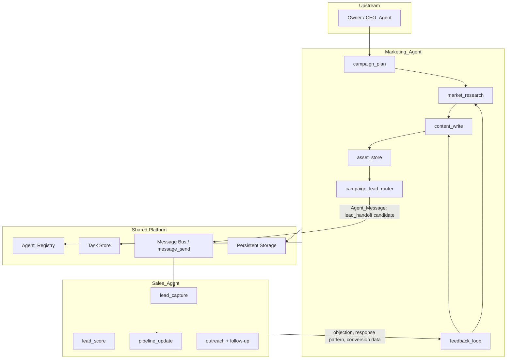
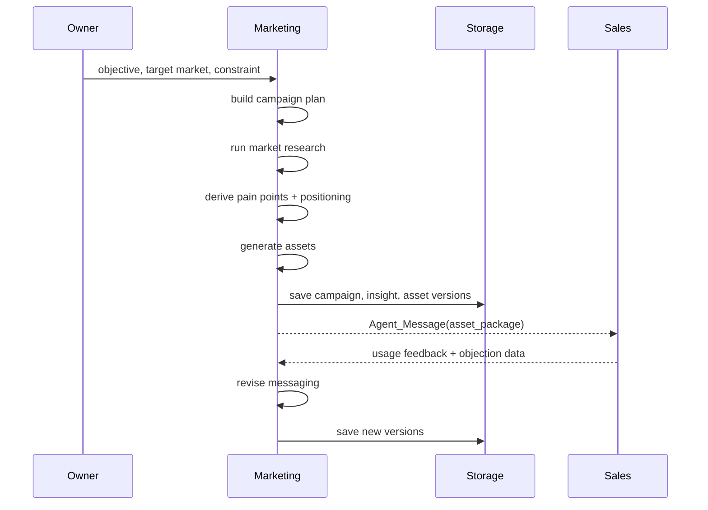
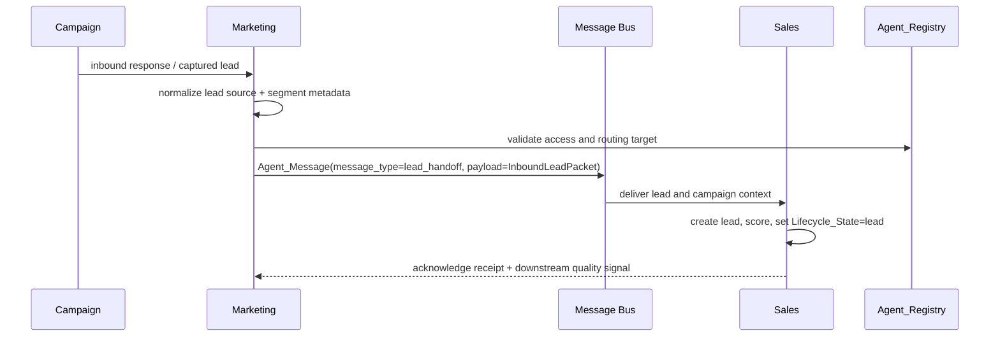
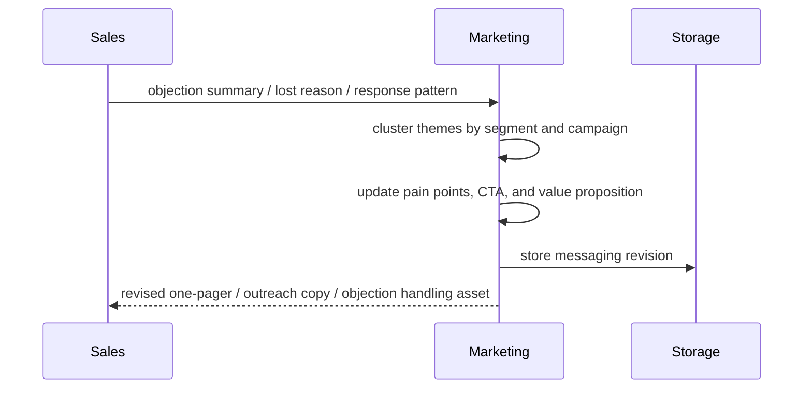

# Design Document

## Marketing Agent

---

## Overview

Dokumen ini menerjemahkan requirement [marketing-agent](/home/rny/work/2026/05-mei/agentai01/.kiro/specs/marketing-agent/requirements.md) ke desain implementasi yang tetap kompatibel dengan spec induk [ai-company-agents](/home/rny/work/2026/05-mei/agentai01/.kiro/specs/ai-company-agents/requirements.md) dan konsumsi langsung oleh [sales-agent](/home/rny/work/2026/05-mei/agentai01/.kiro/specs/sales-agent/requirements.md).

Marketing Agent berperan sebagai mesin demand generation dan messaging intelligence. Agent ini tidak berhenti pada produksi konten, tetapi mengelola siklus penuh:

1. merencanakan campaign dari objective Owner atau CEO_Agent,
2. menghasilkan market insight dan asset siap pakai,
3. mengirim inbound lead beserta metadata campaign ke Sales_Agent,
4. menerima feedback objection dan respons pasar dari Sales_Agent,
5. memperbarui messaging agar loop Marketing ke Sales tetap dua arah.

**Prinsip desain utama:**
- semua artefak marketing harus tertaut ke campaign, segmen, dan versi
- lead generation harus berujung pada handoff eksplisit ke Sales_Agent, bukan hanya laporan pasif
- feedback dari Sales_Agent harus diperlakukan sebagai input inti untuk optimasi campaign berikutnya
- format komunikasi lintas agent wajib mengikuti `Agent_Message` dari spec induk

---

## Architecture

### System Architecture Diagram



### Flow: Campaign Planning to Asset Delivery



### Flow: Marketing to Sales Lead Generation



### Flow: Feedback Loop Marketing and Sales



---

## Components and Interfaces

### 1. Campaign Planner

Mengubah objective menjadi campaign plan yang dapat dieksekusi dan dipantau sebagai `Task`.

```ts
type CampaignPlanner = {
  createCampaignPlan(input: CampaignPlanInput): Promise<CampaignPlan>
  reviseCampaignPlan(campaignId: string, reason: string): Promise<CampaignPlanVersion>
}
```

**Tanggung jawab:**
- menetapkan target audience, channel, CTA, timeline, dan success metrics
- menandai dependency seperti case study, testimonial, atau technical validation
- membuat baseline versi campaign untuk audit

### 2. Market Research Engine

Menyusun insight pasar, pain point, dan positioning yang menjadi bahan asset maupun handoff ke Sales_Agent.

```ts
type MarketResearchTool = {
  summarizeMarket(input: MarketResearchInput): Promise<MarketInsight>
  detectMessagingShift(segmentId: string): Promise<MessagingRecommendation[]>
}
```

**Output minimum:**
- `pain_points`
- `buying_triggers`
- `competitor_pressure`
- `recommended_messaging`
- `recommended_offer_angles`

### 3. Content Writer

Menghasilkan asset marketing dari template campaign dan market insight.

```ts
type ContentWriter = {
  generateAsset(input: AssetDraftInput): Promise<MarketingAsset>
  reviseAsset(assetId: string, feedback: AssetFeedback): Promise<MarketingAssetVersion>
}
```

**Jenis asset minimum:**
- article draft
- landing page copy
- email sequence
- social post
- one-pager value proposition
- objection-handling copy

### 4. Asset Store

Penyimpanan persisten untuk campaign, asset, version history, dan mapping penggunaan asset oleh Sales_Agent.

```ts
type AssetStore = {
  saveCampaign(plan: CampaignPlan): Promise<void>
  saveAsset(asset: MarketingAsset): Promise<void>
  recordSalesUsage(input: SalesAssetUsage): Promise<void>
  listAssetsBySegment(segmentId: string): Promise<MarketingAsset[]>
}
```

### 5. Campaign Lead Router

Komponen yang memastikan setiap lead inbound dari campaign masuk ke pipeline Sales_Agent dengan metadata yang lengkap.

```ts
type CampaignLeadRouter = {
  registerInboundLead(input: InboundLeadPacket): Promise<LeadHandoffResult>
}
```

**Aturan routing:**
- selalu menyertakan `campaign_id`, `source_channel`, `segment_id`, dan `captured_at`
- mengirim ke Sales_Agent dengan `message_type: "lead_handoff"`
- menunggu acknowledgment agar tidak ada lead silent-drop

### 6. Sales Feedback Loop

Menerima sinyal performa lapangan dari Sales_Agent lalu mengubahnya menjadi revisi messaging.

```ts
type SalesFeedbackLoop = {
  ingestSalesFeedback(input: SalesFeedbackPacket): Promise<void>
  generateMessagingRevision(segmentId: string): Promise<MessagingRevision>
}
```

---

## Data Contracts

### CampaignPlan

```ts
type CampaignPlan = {
  campaign_id: string
  objective: string
  target_segments: string[]
  primary_channels: ("website" | "email" | "social")[]
  key_message: string
  call_to_action: string
  success_metrics: string[]
  dependencies: string[]
  version: number
  created_at: string
}
```

### MarketInsight

```ts
type MarketInsight = {
  insight_id: string
  segment_id: string
  pain_points: string[]
  buying_triggers: string[]
  objections: string[]
  positioning_statement: string
  recommended_messaging: string[]
  generated_at: string
}
```

### MarketingAsset

```ts
type MarketingAsset = {
  asset_id: string
  campaign_id: string
  asset_type: "article" | "landing_copy" | "email_sequence" | "social_post" | "one_pager" | "objection_copy"
  segment_id: string
  content: string
  cta: string
  version: number
  status: "draft" | "ready" | "revised"
  created_at: string
}
```

### InboundLeadPacket

```ts
type InboundLeadPacket = {
  lead_id: string
  company_name: string
  contact_name?: string
  contact_channel: string
  source_channel: string
  campaign_id: string
  segment_id: string
  initial_need_summary?: string
  captured_at: string
}
```

### Agent_Message Payloads

```ts
type MarketingToSalesMessage = {
  from: "marketing"
  to: "sales"
  message_type: "lead_handoff" | "status_update"
  project_id: string | null
  timestamp: string
  payload: InboundLeadPacket | AssetPackage
}
```

```ts
type SalesToMarketingFeedbackMessage = {
  from: "sales"
  to: "marketing"
  message_type: "status_update" | "clarification_request"
  project_id: string | null
  timestamp: string
  payload: SalesFeedbackPacket
}
```

Catatan: spec induk tidak membedakan lead-level dan project-level secara terpisah pada kontrak pesan, sehingga untuk lead inbound `project_id` dapat bernilai `null` sampai deal berubah menjadi `won`.

---

## Persistence Model

Semua artefak marketing disimpan agar dapat digunakan ulang dan diaudit.

```text
marketing/
  campaigns/{campaign_id}/plan-v{version}.json
  campaigns/{campaign_id}/assets/{asset_id}-v{version}.md
  campaigns/{campaign_id}/insights/{insight_id}.json
  campaigns/{campaign_id}/lead-handoffs/{lead_id}.json
  segments/{segment_id}/messaging-history.json
  feedback/sales/{yyyy-mm}.jsonl
```

Penyimpanan ini harus kompatibel dengan isolasi artefak di spec induk, dan untuk lead yang belum menjadi proyek disimpan di namespace marketing hingga Sales_Agent membuat konteks proyek formal.

---

## Task Model

Pekerjaan bertahap dimodelkan sebagai `Task` agar dapat dipantau CEO_Agent atau dashboard terpadu.

**Task type minimum:**
- `campaign_planning`
- `market_research`
- `asset_generation`
- `lead_routing`
- `messaging_revision`

**Task lifecycle:**
- `queued`
- `running`
- `waiting_feedback`
- `completed`
- `failed`

---

## Failure Handling

### 1. Lead Handoff Failure

Jika `lead_handoff` tidak di-ack oleh Sales_Agent:
- lead ditandai `pending_sales_ack`
- sistem melakukan retry idempoten
- event dicatat ke audit log
- jika gagal melewati threshold, kirim `status_update` ke CEO_Agent

### 2. Messaging Drift

Jika feedback Sales_Agent menunjukkan mismatch besar antara outreach response dan campaign message:
- buat `messaging_revision` task
- tandai campaign `at_risk`
- cegah asset lama dipromosikan sebagai versi terbaru

### 3. Technical Claim Unverified

Jika asset menyebut capability teknis tanpa input valid dari Product_Agent atau Engineering_Agent:
- asset ditandai `requires_validation`
- distribusi ke Sales_Agent ditahan sampai validasi selesai

---

## Observability

Marketing Agent perlu mengeluarkan sinyal untuk dashboard induk:

- jumlah campaign aktif
- jumlah asset per segment
- jumlah lead inbound per campaign
- acknowledgment rate dari Sales_Agent
- conversion feedback per source channel
- daftar campaign `at_risk`

---

## Implementation Notes

- `campaign_plan`, `content_write`, `market_research`, `asset_store`, dan `message_send` tetap menjadi tool inti sesuai requirement.
- `campaign_lead_router` dan `sales_feedback_loop` dapat diimplementasikan sebagai service internal yang memakai `message_send`, bukan tool publik terpisah.
- Desain ini sengaja menempatkan relasi Marketing ke Sales sebagai loop aktif agar sejalan dengan Requirement 3 pada spec induk, bukan sebagai produksi aset satu arah.
