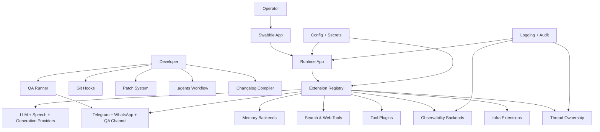
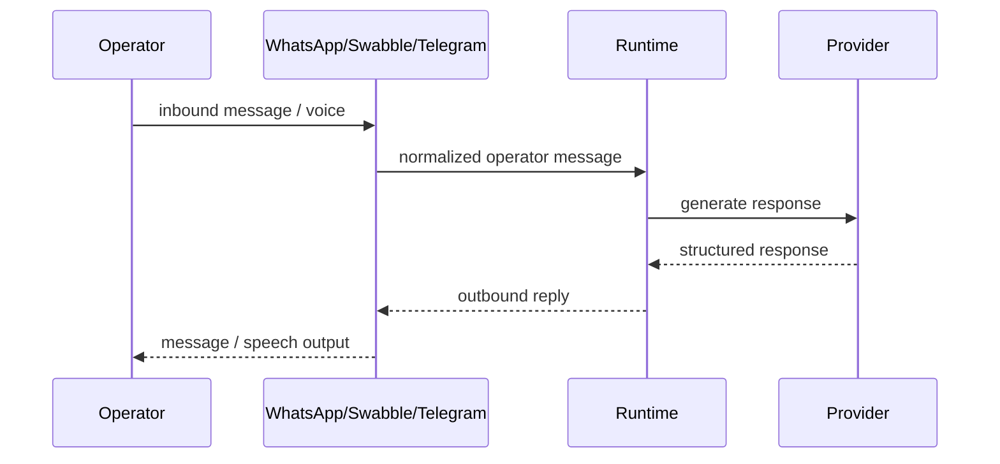
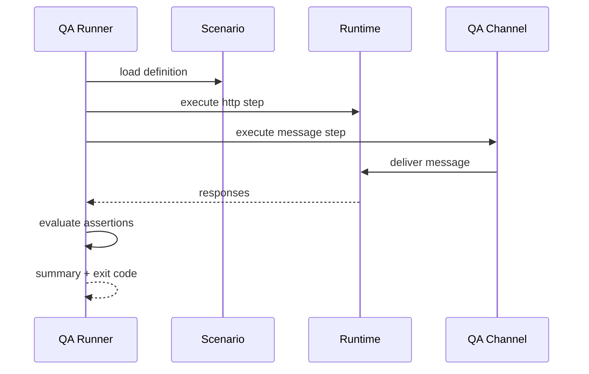

# Design Document

## Medium Priority Adaptation

---

## Overview

Fitur ini mendesain tahap pematangan platform setelah `foundation-adaptation` selesai. Fokusnya adalah memperkuat disiplin engineering dan menambah kapabilitas runtime yang cukup strategis untuk dipakai operasional rutin, tetapi masih berada di bawah level fondasi inti.

Scope medium priority terbagi menjadi dua lapisan besar:

1. tooling dan workflow repo: `qa/`, `git-hooks/`, `patches/`, `.agents/`, `changelog/`, dan `apps/swabble/`
2. extension runtime: additional LLM providers, WhatsApp channel, advanced memory backends, speech core, image/video generation core, search & web tools, tool plugins, observability, infrastructure extensions, QA extensions, dan thread ownership

Prinsip desain utama:

- extension baru wajib berdiri di atas contract yang stabil, bukan mengikat consumer ke vendor atau tool tertentu
- runtime utama tetap sehat walau sebagian extension medium belum diaktifkan
- semua surface baru reuse fondasi config, secrets, logging, audit, dan security yang sudah ada
- tooling engineering harus meningkatkan repeatability dan release discipline, bukan menambah friction yang sulit dipelihara
- medium layer menjadi fondasi bagi low-priority ecosystem berikutnya, terutama untuk speech, generation, search, dan extension contracts

---

## Architecture

### High-Level Medium Layer Architecture



### Placement Strategy

```text
qa/
  scenarios/
  helpers/
  run.mjs

git-hooks/
  install.mjs
  uninstall.mjs
  pre-commit
  commit-msg
  pre-push

patches/
  README.md
  *.patch

.agents/
  README.md
  maintainer-notes/
  skills/

changelog/
  fragments/
  fragments/released/
  template.md
  compile.mjs

apps/swabble/
  ...

src/runtime-app/
  providers/
    openai-compatible
    anthropic-vertex
    groq
    gemini-cli
  channels/
    whatsapp
    qa-channel
  memory/
    core
    lancedb
    wiki
    active-memory
  speech/
    core
    deepgram
    tts-local-cli
  generation/
    image
    video
  tools/
    search/
    web-readability/
    canvas/
    document-extract/
    diffs/
    oc-path/
    llm-task/
    lobster/
  diagnostics/
    otel
    prometheus
  extensions/
    bonjour
    device-pair
    tokenjuice
    voyage
    synthetic
    test-support
    thread-ownership
```

Layout di atas adalah target logical placement. Beberapa folder belum ada saat ini, jadi desain ini memperkenalkannya sebagai struktur baru yang tetap mengikuti boundary runtime app.

---

## Components and Interfaces

### 1. QA Scenario Runner

`qa/` menjadi lapisan scenario-based verification untuk runtime yang sedang berjalan. Ia tidak menggantikan `bun test`, tetapi mengisi celah untuk behavior end-to-end.

Kontrak minimum skenario:

```ts
type QaScenario = {
  name: string
  steps: QaStep[]
}

type QaStep =
  | { type: "http"; request: { method: string; path: string; body?: unknown } ; expect: QaExpectation[] }
  | { type: "message"; channel: string; payload: unknown; expect: QaExpectation[] }

type QaExpectation = {
  label: string
  actualPath: string
  equals?: unknown
  includes?: unknown
}
```

Runner:

- load skenario dari `qa/scenarios/`
- support `--scenario` dan `--base-url`
- lapor step failure dengan expected vs actual
- gunakan `qa/helpers/` untuk request builders dan common assertions

### 2. Git Hooks

Git hooks adalah guardrail lokal untuk developer workflow.

Perilaku minimum:

- `pre-commit` menjalankan `npm run check`
- `commit-msg` memvalidasi conventional commit format
- `pre-push` menjalankan `bun test`
- install/uninstall via script agar reproducible

Hook logic sengaja dibuat kecil dan eksplisit. Mereka memanggil command repo yang sudah ada, bukan menduplikasi logic validasi.

### 3. Dependency Patch System

`patches/` menyimpan patch auditable untuk dependency. Desainnya:

- format file `<package-name>+<version>.patch`
- aplikasi otomatis lewat `postinstall`
- metadata manusia di `patches/README.md`
- failure message harus menunjukkan mismatch package/version

Patch system wajib idempotent dan tidak boleh mengandalkan edit manual `node_modules/`.

### 4. AI-Assisted Workflow

`.agents/` adalah lapisan konteks untuk AI-assisted development di repo ini, berbeda dari `skills/` low-priority ecosystem.

Komponen:

- `.agents/maintainer-notes/` untuk area-specific notes
- `.agents/skills/` untuk skill definitions yang ringan dan repo-scoped
- `.agents/README.md` untuk navigasi dan convention

Workflow ini tidak menyimpan secret dan tidak menjadi source of truth arsitektur formal; ia melengkapi `AGENTS.md`, `CODEX.md`, dan spec documents.

### 5. Changelog Management

Changelog system menggunakan fragments terstruktur agar release note tidak ditulis manual dari nol.

Struktur fragment:

```text
changelog/fragments/<id>-<type>.md
```

Compiler:

- load unreleased fragments
- validasi tipe `feat|fix|breaking|chore`
- group by type
- sort chronologically
- compile ke `CHANGELOG.md`
- pindahkan fragments ke `changelog/fragments/released/`

### 6. Swabble Voice Interface App

`apps/swabble/` adalah standalone voice operator interface untuk runtime.

Peran utamanya:

- ambil input mikrofon
- transcribe via `Speech_Core`
- kirim operator message ke runtime
- putar balasan runtime via TTS
- fallback ke text mode jika speech backend unavailable

State UI minimum:

```text
idle -> listening -> transcribing -> sending -> speaking
                         \-> text_fallback
                         \-> error
```

### 7. Additional LLM Providers

Provider `anthropic-vertex`, `groq`, dan `gemini-cli` duduk di atas provider contract yang sama dengan adapter OpenAI-compatible yang sudah ada.

Kontrak minimum:

```ts
type ProviderRequest = {
  messages: Array<{ role: "system" | "user" | "assistant"; content: string }>
  temperature?: number
}

type ProviderResponse = {
  model: string
  content: string
  latencyMs: number
  raw: unknown
}

type ProviderAdapter = {
  id: string
  enabled(config: unknown): boolean
  generateText(request: ProviderRequest): Promise<ProviderResponse>
}
```

Semua provider harus:

- membaca config via subsystem yang ada
- memetakan rate limit/timeout/invalid key ke internal error type
- tidak melog raw vendor responses saat gagal

### 8. WhatsApp Channel

WhatsApp channel adalah sibling dari Telegram channel yang sudah ada.

Responsibilities:

- validate Meta webhook signature
- filter nomor berdasarkan `WHATSAPP_ALLOWED_NUMBERS`
- transform inbound event menjadi operator message runtime
- kirim outbound runtime response ke WhatsApp API
- acknowledge cepat untuk menghindari retry vendor

Ia tetap hanya operator shell, bukan channel multi-tenant.

### 9. Advanced Memory Backends

Medium adaptation memperkenalkan abstraction memory yang lebih kaya:

- `memory-core` sebagai baseline
- `memory-lancedb` untuk vector search
- `memory-wiki` untuk structured/full-text documents
- `active-memory` untuk working memory sesi aktif

Kontrak backend minimum:

```ts
type MemoryBackend = {
  store(key: string, value: unknown): Promise<void>
  retrieve(key: string): Promise<unknown | null>
  search(query: string): Promise<unknown[]>
  delete(key: string): Promise<void>
}
```

Fallback ke `memory-core` wajib tersedia bila backend opsional tidak siap.

### 10. Speech & Voice Core

`Speech_Core` adalah abstraction untuk STT dan TTS yang dipakai runtime dan `apps/swabble/`.

Backends awal:

- `deepgram` untuk STT
- `tts-local-cli` untuk TTS

Kontraknya harus menyatukan error handling, timeout, dan non-persistence audio policy.

### 11. Image & Video Generation Core

Medium layer belum masuk provider-provider premium low-priority, tetapi menyiapkan core abstraction untuk itu.

Kontrak minimum:

```ts
type ImageGenerationRequest = {
  prompt: string
  model?: string
  size?: string
  format?: string
}

type VideoGenerationRequest = {
  prompt: string
  image?: string
  model?: string
  duration?: number
  resolution?: string
  format?: string
}
```

Core bertanggung jawab pada:

- interface standard
- timeout
- normalized error
- pluggability untuk backend berikutnya

### 12. Search & Web Tools

Tools `brave`, `duckduckgo`, `exa`, `tavily`, dan `web-readability` menjadi search layer umum bagi agent/tooling.

Kontrak minimum:

```ts
type SearchResult = {
  title: string
  url: string
  snippet: string
}

type SearchTool = {
  id: string
  search(query: string, options?: unknown): Promise<SearchResult[]>
}
```

`web-readability` adalah extractor, bukan search engine, tetapi tetap masuk tool family yang sama untuk web workflows.

### 13. Tool Plugins

Plugin medium priority:

- `canvas`
- `document-extract`
- `diffs`
- `oc-path`
- `llm-task`
- `lobster`

Semua sebaiknya mematuhi contract seragam:

```ts
type ExtensionContract<TInput, TOutput> = {
  id: string
  enabled(config: unknown): boolean
  validate(input: unknown): { ok: true; value: TInput } | { ok: false; message: string }
  execute(input: TInput): Promise<TOutput>
}
```

Khusus tool berbasis file path, validasi path boundary wajib reuse security/shared helpers.

### 14. Diagnostics & Observability

Observability medium layer memiliki dua backend:

- `diagnostics-otel`
- `diagnostics-prometheus`

Karakteristik:

- best-effort, bukan hard dependency runtime
- no secret in metric labels or trace attrs
- capture agent handoff, approval, provider call, dan message throughput
- expose `/metrics` bila Prometheus diaktifkan

### 15. Infrastructure Extensions

Extensions:

- `bonjour` untuk local mDNS discovery
- `device-pair` untuk pairing device <-> runtime
- `tokenjuice` untuk token accounting/budget
- `voyage` untuk embeddings
- `synthetic` untuk synthetic data generation

Peran desain medium di sini adalah memperkenalkan abstraction dan activation model, bukan memaksa semua extension aktif bersamaan.

### 16. QA & Testing Extensions

`qa-channel` dan `test-support` memperkaya testing path:

- `qa-channel` memberi channel virtual yang memproses pesan setara channel nyata
- `test-support` memberi helper setup/teardown runtime test environments
- recording/replay dipakai untuk regression scenarios

QA runner memanfaatkan channel ini untuk menghindari ketergantungan ke Telegram/WhatsApp saat automation.

### 17. Thread Ownership

`thread-ownership` melacak kepemilikan kerja antar agent agar konflik bisa dicegah.

State minimum:

```ts
type ThreadOwnershipRecord = {
  projectId: string
  threadId: string
  ownerAgentId: string | null
  claimedAt: string | null
  expiresAt: string | null
}
```

Flow:

- claim
- conflict rejection
- transfer with approval gate
- auto-release on timeout
- audit log visibility

---

## Cross-Cutting Policies

### Config and Secrets

Semua provider, channel, backend, dan tool medium priority membaca secret via config/secrets subsystem yang sudah ada. Tidak boleh ada raw `process.env` spread ke seluruh adapter layer.

### Logging and Audit

Surface berikut wajib structured logging:

- provider calls
- channel ingress/egress
- QA scenario execution
- token budget warnings
- ownership conflicts/transfers

Audit log eksplisit dibutuhkan untuk channel actions, ownership changes, dan tool/plugin execution yang memengaruhi state.

### Enable/Disable Gating

Semua extension medium priority harus bisa diaktifkan atau dimatikan via konfigurasi tanpa ubah core runtime code path. Ini penting agar rollout bisa bertahap dan low-risk.

---

## Data Flow

### Operator Channel Flow



### QA Scenario Flow



---

## Adoption Strategy

### Phase 1: Engineering Workflow

- implement `qa/`, `git-hooks/`, `patches/`, `.agents/`, dan `changelog/`
- ini memperkuat discipline sebelum extension runtime makin banyak

### Phase 2: Core Runtime Extensions

- additional LLM providers
- WhatsApp channel
- speech core
- memory abstractions
- search/web tools

### Phase 3: Productive Operator Surfaces

- `apps/swabble/`
- diagnostics backends
- selected tool plugins

### Phase 4: Advanced Coordination

- infrastructure extensions
- QA channel/test-support
- thread ownership

### Phase 5: Prepare for Low-Priority Expansion

- pastikan speech, generation, search, dan extension contracts stabil
- ini jadi fondasi langsung untuk premium providers dan advanced tool ecosystem di low priority

---

## Risks and Mitigations

- Risiko: extension layer menjadi terlalu heterogen dan sulit dipelihara.
  Mitigasi: pakai `Extension_Contract` dan normalized error/logging policy.

- Risiko: WhatsApp dan voice surfaces menambah secret dan operasional burden.
  Mitigasi: config gating, readiness checks, dan fallback mode yang jelas.

- Risiko: QA runner flaky terhadap runtime yang hidup.
  Mitigasi: deterministic scenario format, helper reuse, dan QA virtual channel.

- Risiko: token/accounting dan ownership state drift.
  Mitigasi: explicit state model, audit log, dan timeout-driven cleanup.

---

## Success Criteria

Desain ini dianggap berhasil bila:

- repo punya workflow engineering yang lebih repeatable dan release-friendly
- runtime dapat menambah provider/channel/backend tanpa menyentuh agent logic
- operator punya surface interaksi baru yang tetap aman dan observable
- QA layer naik dari unit-only menjadi scenario-driven verification
- medium layer benar-benar menjadi jembatan stabil menuju low-priority ecosystem
