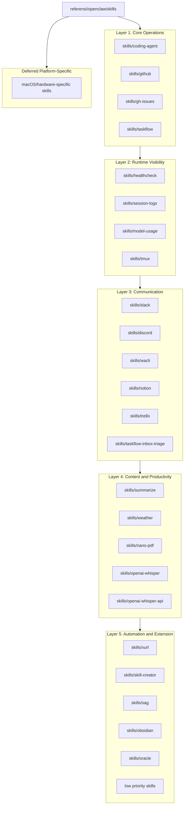

# Design Document

## OpenClaw Skills Adaptation

---

## Overview

Fitur ini mendesain adaptasi seluruh skill di `referensi/openclaw/skills/` ke katalog `skills/` AI Company Runtime Platform.

Adaptasi skill berbeda dari adaptasi source module:

- banyak skill adalah operational playbook, bukan library runtime
- beberapa skill butuh binary atau akun eksternal
- sebagian skill hanya relevan sebagai dokumentasi workflow
- executable skill harus mematuhi kontrak `skills/README.md`

Karena itu desain ini membedakan **Guidance_Skill** dan **Executable_Skill**. Keduanya wajib punya `SKILL.md`; hanya executable skill yang wajib punya `skill.json`, `index.mjs`, dan test runtime.

---

## Architecture

### Skill Adaptation Layers



### Repo Mapping Strategy

```text
skills/
  coding-agent/
    SKILL.md
    templates/

  github/
    SKILL.md
    templates/

  gh-issues/
    SKILL.md
    templates/

  taskflow/
    SKILL.md

  healthcheck/
    SKILL.md

  session-logs/
    SKILL.md

  model-usage/
    SKILL.md

  tmux/
    SKILL.md

  slack/
    SKILL.md

  notion/
    SKILL.md

  weather/
    SKILL.md
    skill.json       optional when implemented as runtime executable
    index.mjs        optional when implemented as runtime executable
    index.test.ts    optional when implemented as runtime executable
```

Existing executable skill conventions remain authoritative:

- `skill.json` describes runtime discovery metadata
- `index.mjs` exports the skill implementation
- `index.test.ts` verifies behavior
- `SKILL.md` explains when and how an agent/operator should use the skill

---

## Design Principles

### 1. Playbook First, Runtime Second

Most OpenClaw skills encode operational knowledge. The first adaptation pass should preserve that knowledge in `SKILL.md` before deciding whether to expose a runtime callable implementation.

### 2. Project-Native Language

Adapted docs should use this repo's concepts:

- AI Company Runtime Platform
- operator shell
- runtime app
- provider
- Telegram bot and future channel adapters
- `skills/workshop.mjs`
- `SkillRegistry`

OpenClaw-only commands, state paths, hub names, and message tools must be removed or translated.

### 3. External Boundaries Are Explicit

Any skill that uses an external binary or API must state:

- required tool
- install hint for Linux
- credential source
- read-only commands
- mutating commands
- confirmation requirements
- validation command

### 4. Security by Default

Skill docs must avoid examples that leak secrets. Write actions to external systems should require explicit target and confirmation. Logs, transcript summaries, and terminal output examples must redact credentials.

### 5. Deferred Is a Valid Status

macOS-specific, hardware-specific, or account-specific skills should be classified instead of forced into the Linux runtime. Deferred skills remain discoverable in the roadmap but do not add dependencies.

---

## Components and Interfaces

### Skill Documentation Contract

Every `SKILL.md` should follow a consistent structure:

````md
# <Skill Name>

## Use When

- ...

## Requirements

- Binary/API/account requirements
- Environment variables
- Optional dependencies

## Workflow

1. Inspect context
2. Run read-only discovery
3. Confirm target for write actions
4. Execute
5. Verify result

## Safety

- Secret handling
- Confirmation rules
- Rate-limit notes

## Validation

```bash
...
```
````

This contract is intentionally documentation-oriented so it works for both guidance-only and executable skills.

### Executable Skill Contract

Executable skills must align with `skills/README.md`:

```text
skills/<name>/
  SKILL.md
  skill.json
  index.mjs
  index.test.ts
```

The runtime contract remains JSON-only at the boundary:

```ts
type SkillInvocation = {
  input: Record<string, unknown>
  context?: Record<string, unknown>
}

type SkillResult = {
  ok: boolean
  data?: unknown
  error?: {
    code: string
    message: string
  }
}
```

The exact implementation shape should follow existing registry expectations rather than introducing a new loader.

### Status Metadata

Each adapted skill should be tracked in an index with a simple status:

```ts
type SkillAdaptationStatus =
  | "adapted-guidance"
  | "adapted-executable"
  | "deferred"
  | "ignored"
```

Recommended metadata:

```json
{
  "name": "github",
  "source": "referensi/openclaw/skills/github",
  "target": "skills/github",
  "status": "adapted-guidance",
  "requires": ["gh"],
  "secrets": ["GH_TOKEN"],
  "validation": ["gh --version"]
}
```

This can start as documentation in `skills/README.md` and later become generated metadata if useful.

---

## Batch Design

### Batch 1: Core Operations

Targets:

- `coding-agent`
- `github`
- `gh-issues`
- `taskflow`

Design focus:

- delegation patterns
- GitHub issue and PR operations
- background task lifecycle
- worktree-based parallelism
- progress updates to operator channels

This batch should produce high-quality guidance skills first. Runtime executables are optional unless a workflow is narrow and deterministic.

### Batch 2: Operational Visibility

Targets:

- `healthcheck`
- `session-logs`
- `model-usage`
- `tmux`

Design focus:

- `/health` and `/ready`
- transcript/log analysis
- model and cost summaries
- tmux session inspection
- redaction in diagnostic output

### Batch 3: Communication and Collaboration

Targets:

- `taskflow-inbox-triage`
- `slack`
- `discord`
- `wacli`
- `notion`
- `trello`

Design focus:

- read/write separation
- explicit target identifiers
- confirmation before external messages
- API version notes
- auth via environment or local secret storage

### Batch 4: Content and Productivity

Targets:

- `summarize`
- `weather`
- `nano-pdf`
- `openai-whisper`
- `openai-whisper-api`

Design focus:

- content summarization
- no-secret utility calls
- document and media temp file handling
- transcription privacy
- provider/API configuration

`weather` is a good candidate for an executable skill because it can be no-secret and bounded.

### Batch 5: Automation and Extension

Targets:

- `xurl`
- `skill-creator`
- `sag`
- `obsidian`
- `oracle`
- selected miscellaneous skills

Design focus:

- social posting guardrails
- skill authoring workflow
- structured sub-agent spawning
- database credential boundaries
- deferred/ignored rationale for niche skills

### Batch 6: Deferred Platform-Specific Skills

Targets:

- Apple Notes
- Apple Reminders
- Bear Notes
- Things
- iMessage
- camera/screen capture tools
- Hue, Sonos, Spotify playback, Bluetooth
- local ONNX TTS and similar machine-specific tools

Design focus:

- classify, do not implement by default
- avoid new setup dependencies
- document possible future use cases only when real

---

## Safety Model

### Read-Only Before Write

All external integration skills should teach this flow:

1. inspect available state with read-only commands
2. identify exact target
3. summarize intended write
4. ask for confirmation when externally visible or destructive
5. execute
6. verify

### Secrets

Skills may name environment variables, but must never include real values. Examples should use placeholders:

```bash
export GH_TOKEN="<set-in-env-or-secret-store>"
```

Command examples should avoid `set -x` and avoid printing auth config.

### Destructive Actions

Destructive actions include:

- deleting or editing external messages
- posting to public channels
- closing issues or PRs
- modifying Notion/Trello records
- sending WhatsApp messages
- writing to databases
- running terminal commands in an existing tmux session

These require explicit target and confirmation unless the user already provided an unambiguous direct instruction.

---

## Testing Strategy

Guidance-only skills:

- verify `SKILL.md` exists
- verify OpenClaw-specific terms are removed or intentionally referenced as source context
- verify required tools and validation commands are documented

Executable skills:

- run `bun skills/workshop.mjs validate skills/<name>`
- run `bun test skills/<name>`
- use narrow mocks for network/API calls
- avoid real credentials in tests

Repo-level validation:

- run `npm run check` when TypeScript or runtime contracts changed
- run `bun test` when executable skill code changed
- run targeted docs review for guidance-only batches

---

## Migration Notes

1. Do not edit `referensi/openclaw/skills/`.
2. Start each skill by reading its reference `SKILL.md` and any directly referenced scripts/templates.
3. Keep assets only when they are useful and project-appropriate.
4. Convert OpenClaw command examples into project-native commands or mark them as external tool workflows.
5. Update the skills index after each batch so status stays visible.
