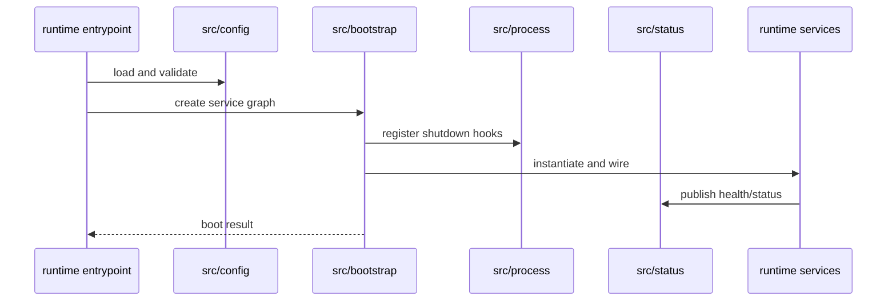
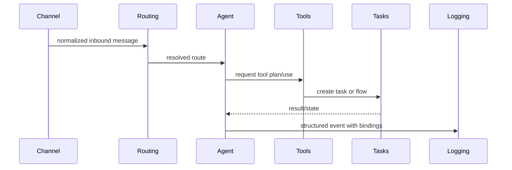
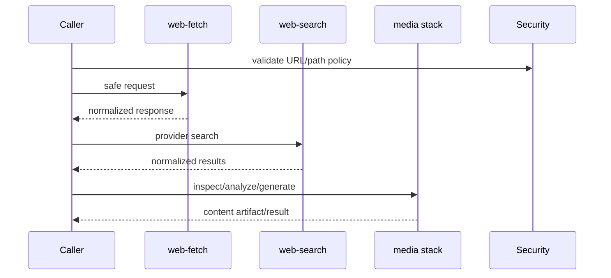

# Design Document

## OpenClaw Src Adaptation

---

## Overview

Fitur ini mendesain adaptasi menyeluruh modul-modul `referensi/openclaw/src/` ke AI Company Runtime Platform. Ini bukan feature runtime tunggal, melainkan program arsitektur untuk memperluas lapisan `src/` project ini agar:

- foundation utilities lebih matang
- runtime services lebih modular
- memory, tools, channel, protocol, dan observability punya contract yang eksplisit
- operator surfaces seperti web, CLI, TUI, voice, dan wizard berdiri di atas shared primitives

Desain ini mengikuti prinsip dari `TODO-2.md`:

1. semua modul dianggap relevan sebagai sumber pola
2. implementasi harus disesuaikan ke arsitektur repo ini
3. modul unsupported atau terlalu OpenClaw-specific dibuang
4. semua hasil adaptasi harus testable dan incremental

---

## Architecture

### Layered Adaptation Model

```mermaid
graph TB
    REF[referensi/openclaw/src]

    subgraph L1["Layer 1: Leaf Foundations"]
        LOG[src/logging]
        UTL[src/utils]
        SHR[src/shared]
        INF[src/infra]
        SECRET[src/secrets]
        SEC[src/security]
        TYPES[src/types]
    end

    subgraph L2["Layer 2: Runtime Core"]
        PR[src/provider-runtime]
        PROC[src/process]
        STATUS[src/status]
        CONFIG[src/config]
        BOOT[src/bootstrap]
        BIND[src/bindings]
        COMPAT[src/compat]
    end

    subgraph L3["Layer 3: State and Execution"]
        SESS[src/sessions]
        MEM[src/memory]
        MEMSDK[src/memory-host-sdk]
        CTX[src/context-engine]
        TOOLS[src/tools]
        TASKS[src/tasks]
        FLOWS[src/flows]
    end

    subgraph L4["Layer 4: Extension and Communication"]
        HOOKS[src/hooks]
        ROUTE[src/routing]
        PLUG[src/plugins]
        SDK[src/plugin-sdk]
        PST[src/plugin-state]
        CH[src/channels]
        AR[src/auto-reply]
        COMMIT[src/commitments]
        GATE[src/gateway]
        ACP[src/acp]
        MCP[src/mcp]
    end

    subgraph L5["Layer 5: Orchestration and Content"]
        AG[src/agents]
        CRON[src/cron]
        DAE[src/daemon]
        WF[src/web-fetch]
        WS[src/web-search]
        LINK[src/link-understanding]
        MEDIA[src/media*]
        VOICE[src/tts|talk|realtime-transcription]
    end

    subgraph L6["Layer 6: Surfaces and Productization"]
        WEB[src/web]
        CLI[src/cli]
        TERM[src/terminal]
        TUI[src/tui]
        MD[src/markdown]
        INT[src/interactive]
        TRAJ[src/trajectory]
        PROXY[src/proxy-capture]
        PAIR[src/pairing]
        NODE[src/node-host]
        CREST[src/crestodian]
        DOCS[src/docs]
        SCRIPTS[src/scripts]
        I18N[src/i18n]
        MCAT[src/model-catalog]
        CHAT[src/chat]
        CMD[src/commands]
        WIZ[src/wizard]
    end

    REF --> L1
    L1 --> L2
    L2 --> L3
    L3 --> L4
    L4 --> L5
    L5 --> L6
```

Desain ini sengaja berlapis agar batch awal menghasilkan leaf dependencies yang bisa dipakai ulang oleh batch berikutnya, bukan memindahkan kompleksitas ad-hoc ke tempat baru.

### Repo Mapping Strategy

```text
src/
  logging/                upgrade existing subsystem
  shared/                 upgrade existing subsystem
  secrets/                upgrade existing subsystem
  security/               upgrade existing subsystem
  types/                  upgrade existing subsystem

  utils/                  new leaf helper module
  infra/                  new filesystem/runtime-safe helper module
  process/                new process lifecycle module
  status/                 new status/state reporting module
  sessions/               new session lifecycle module
  memory/                 new memory namespace and persistence module
  memory-host-sdk/        new provider-facing memory contract
  context-engine/         new context management engine
  tools/                  new tool contract layer
  tasks/                  new task registry layer
  flows/                  new flow execution layer
  hooks/                  new hook framework
  routing/                new message routing layer
  plugins/                new plugin loader/registry
  plugin-sdk/             new plugin public contract
  plugin-state/           new plugin state persistence
  channels/               new generic channel abstraction
  auto-reply/             new policy layer
  commitments/            new operator commitment tracking
  gateway/                new protocol-facing gateway layer
  acp/                    new internal agent communication contract
  mcp/                    new MCP bridge/server layer
  cron/                   new scheduled execution layer
  daemon/                 new daemon coordination layer
  web-fetch/              new safe fetch layer
  web-search/             new normalized search layer
  link-understanding/     new URL inspection layer
  media*/                 new media primitives and orchestration
  tts/                    new TTS contract layer
  talk/                   new voice conversation layer
  realtime-transcription/ new realtime STT layer
  web/                    new shared web server utilities
  cli/                    new CLI foundation
  terminal/               new terminal rendering helpers
  tui/                    new TUI foundation
  markdown/               new markdown utilities
  interactive/            new prompt/menu utilities
  config/                 new repo-wide config core, aligned with runtime-app/config
  bootstrap/              new boot sequence / DI layer
  bindings/               new native binding abstraction
  compat/                 new compatibility/deprecation helpers
  trajectory/             new action tracing layer
  proxy-capture/          new debugging capture layer
  pairing/                new pairing protocol layer
  node-host/              new node host abstraction
  crestodian/             new credential store abstraction
  docs/                   new doc generation utilities
  scripts/                new in-src script helper layer
  i18n/                   new localization primitives
  model-catalog/          new model metadata layer
  chat/                   new chat abstraction layer
  commands/               new command registry/execution
  wizard/                 new onboarding/setup flows
```

---

## Design Principles

### 1. Reference-Informed, Not Reference-Shaped

Kita mengambil:

- interface ideas
- layering patterns
- lifecycle/state models
- safety/observability primitives

Kita tidak mengambil:

- nama produk OpenClaw
- multi-platform app assumptions
- native/mobile-specific branches yang tidak relevan
- direct structural coupling ke referensi

### 2. Current Runtime First

Walau modul target banyak, desain harus tetap memusat pada kebutuhan project ini:

- `src/runtime-app/` tetap operator shell utama
- `src/domain/`, `src/registry/`, dan existing agent folders tetap menjadi business core
- modul baru masuk sebagai services/contracts yang memperjelas boundary di sekitarnya

### 3. Leaf Before Branch

Urutan implementasi wajib mengutamakan leaf modules:

- `logging`
- `utils`
- `shared`
- `infra`
- `secrets`
- `security`
- `types`

Modul yang lebih tinggi seperti `gateway`, `agents`, `channels`, dan `wizard` baru dibangun setelah lapisan bawah stabil.

### 4. Coexistence with Existing Code

Karena beberapa area sudah ada, terutama di `src/runtime-app/`, `src/logging/`, `src/shared/`, `src/secrets/`, dan `src/security/`, adaptasi tidak diasumsikan greenfield. Desain harus mendukung:

- strengthen existing modules in place
- move ad-hoc helpers ke modul baru secara bertahap
- compatibility adapters saat migrasi belum selesai

---

## Components and Interfaces

### 1. Foundation Utility Cluster

Cluster ini mencakup `src/logging/`, `src/utils/`, `src/shared/`, `src/infra/`, `src/secrets/`, `src/security/`, dan `src/types/`.

Peran:

- menyediakan leaf dependencies tanpa import ke business logic
- menjadi basis retry, IDs, timestamps, result types, safe I/O, redaction, audit, dan utility types

Contract examples:

```ts
type Result<T, E> = { ok: true; value: T } | { ok: false; error: E }

type Logger = {
  debug(message: string, context?: Record<string, unknown>): void
  info(message: string, context?: Record<string, unknown>): void
  warn(message: string, context?: Record<string, unknown>): void
  error(message: string, context?: Record<string, unknown>): void
  child(bindings: Record<string, unknown>): Logger
}
```

### 2. Runtime Core Cluster

Cluster ini mencakup `src/provider-runtime/`, `src/process/`, `src/status/`, `src/config/`, `src/bootstrap/`, `src/bindings/`, dan `src/compat/`.

Peran:

- memisahkan startup, shutdown, provider resilience, global status, dan fallback behavior dari entrypoint runtime-app

Key design:

- `provider-runtime` menangani retry, timeout, circuit breaker, health checks
- `process` menangani signal coordination dan lifecycle
- `status` menyediakan aggregator lintas service
- `config` menjadi repo-wide config core, tetapi tetap menghormati boundary `src/runtime-app/config/`
- `bootstrap` menjadi orchestrator service registration

### 3. Stateful Context Cluster

Cluster ini mencakup `src/sessions/`, `src/memory/`, `src/memory-host-sdk/`, dan `src/context-engine/`.

Peran:

- menyimpan state yang hidup lebih lama dari satu request
- menghubungkan session, memory namespace, dan context budget

Data model sketch:

```ts
type SessionRecord = {
  sessionId: string
  state: "created" | "active" | "idle" | "closed"
  projectId?: string
  modelOverride?: string
  expiresAt?: string
}
```

### 4. Execution Fabric

Cluster ini mencakup `src/tools/`, `src/tasks/`, `src/flows/`, `src/hooks/`, `src/routing/`, `src/plugins/`, `src/plugin-sdk/`, dan `src/plugin-state/`.

Peran:

- mendefinisikan pekerjaan, tools, routing, extension loading, dan lifecycle execution yang konsisten

Contract direction:

```ts
type ExtensionContract<TInput, TOutput> = {
  id: string
  enabled(config: unknown): boolean
  validate(input: unknown): Result<TInput, string>
  execute(input: TInput): Promise<TOutput>
}
```

### 5. Communication and Protocol Fabric

Cluster ini mencakup `src/channels/`, `src/auto-reply/`, `src/commitments/`, `src/gateway/`, `src/acp/`, dan `src/mcp/`.

Peran:

- menormalkan inbound/outbound communication
- memisahkan transport contract dari orchestration internals
- memfasilitasi approval, routing, auto-reply, dan tool serving

### 6. Orchestration and Scheduling

Cluster ini mencakup `src/agents/`, `src/cron/`, dan `src/daemon/`.

Peran:

- memberi lapisan service untuk agent lifecycle, delegation, scheduled jobs, dan daemonized workers

Current-code constraint:

- existing business agent implementations tetap dipertahankan
- adaptasi fokus pada shared agent runtime contracts di sekelilingnya

### 7. Content and Media Stack

Cluster ini mencakup `src/web-fetch/`, `src/web-search/`, `src/link-understanding/`, `src/media/`, `src/media-understanding/`, `src/media-generation/`, `src/image-generation/`, `src/video-generation/`, `src/music-generation/`, `src/tts/`, `src/talk/`, dan `src/realtime-transcription/`.

Peran:

- safe access ke external content
- normalized media pipeline
- provider-agnostic generation/understanding contracts
- voice interaction primitives

### 8. Operator Surface Foundation

Cluster ini mencakup `src/web/`, `src/cli/`, `src/terminal/`, `src/tui/`, `src/markdown/`, `src/interactive/`, `src/chat/`, `src/commands/`, dan `src/wizard/`.

Peran:

- menyediakan primitives bagi UI, CLI, chat, docs, dan onboarding flows
- mengurangi duplikasi formatting, parsing, dan interaction logic di operator surfaces masa depan

### 9. Productization and Diagnostics

Cluster ini mencakup `src/trajectory/`, `src/proxy-capture/`, `src/pairing/`, `src/node-host/`, `src/crestodian/`, `src/docs/`, `src/scripts/`, `src/i18n/`, dan `src/model-catalog/`.

Peran:

- meningkatkan debuggability, portability, discoverability, dan operator readiness

---

## Data Flow

### Boot and Service Registration Flow



### Message and Tool Execution Flow



### Content Access Flow



---

## Batch Strategy

### Batch 1: Leaf Foundations

- `logging`, `utils`, `shared`, `infra`, `secrets`, `security`, `types`

Outcome:

- semua modul leaf tersedia
- helper ad-hoc mulai dipindahkan keluar dari runtime-app

### Batch 2: Runtime Core

- `provider-runtime`, `process`, `status`, `config`, `bootstrap`, `bindings`, `compat`

Outcome:

- startup/shutdown/provider behavior lebih modular

### Batch 3: Stateful Context

- `sessions`, `memory`, `memory-host-sdk`, `context-engine`

Outcome:

- session dan context lifecycle eksplisit

### Batch 4: Execution Fabric

- `tools`, `tasks`, `flows`, `hooks`, `routing`, `plugins`, `plugin-sdk`, `plugin-state`

Outcome:

- extension dan execution contracts lebih rapi

### Batch 5: Communication and Orchestration

- `channels`, `auto-reply`, `commitments`, `gateway`, `acp`, `mcp`, `agents`, `cron`, `daemon`

Outcome:

- transport/protocol/orchestration layer formalized

### Batch 6: Content, Voice, and Surfaces

- `web-fetch`, `web-search`, `link-understanding`, `media*`, `tts`, `talk`, `realtime-transcription`, `web`, `cli`, `terminal`, `tui`, `markdown`, `interactive`

Outcome:

- operator surfaces dan media stack mulai reusable

### Batch 7: Productization and Diagnostics

- `trajectory`, `proxy-capture`, `pairing`, `node-host`, `crestodian`, `docs`, `scripts`, `i18n`, `model-catalog`, `chat`, `commands`, `wizard`

Outcome:

- tooling productization, debugging, and onboarding complete

---

## Risks and Mitigations

- Risiko: scope 66 modul terlalu besar untuk satu gelombang kerja.
  Mitigasi: pakai batch execution, dependency layering, dan acceptance tests per batch.

- Risiko: modul baru mengulang capability yang sudah ada di `src/runtime-app/`.
  Mitigasi: desain menekankan strengthen-and-extract, bukan parallel shadow implementations jangka panjang.

- Risiko: adaptasi membuat import graph makin rumit.
  Mitigasi: leaf-first layering, contract-first APIs, dan boundary checks tetap dipakai.

- Risiko: provider/content modules memperbesar security surface.
  Mitigasi: route semua network/path/secret handling lewat `security`, `infra`, `secrets`, dan `logging`.

---

## Success Criteria

Desain ini dianggap berhasil bila:

- roadmap 66 modul bisa dieksekusi bertahap tanpa kehilangan konteks arsitektur
- modul hasil adaptasi memperkaya `src/` tanpa merusak boundary repo yang sudah ada
- runtime-app menjadi lebih tipis karena shared services pindah ke lapisan `src/` yang reusable
- setiap batch menghasilkan contracts yang bisa langsung dipakai batch berikutnya
