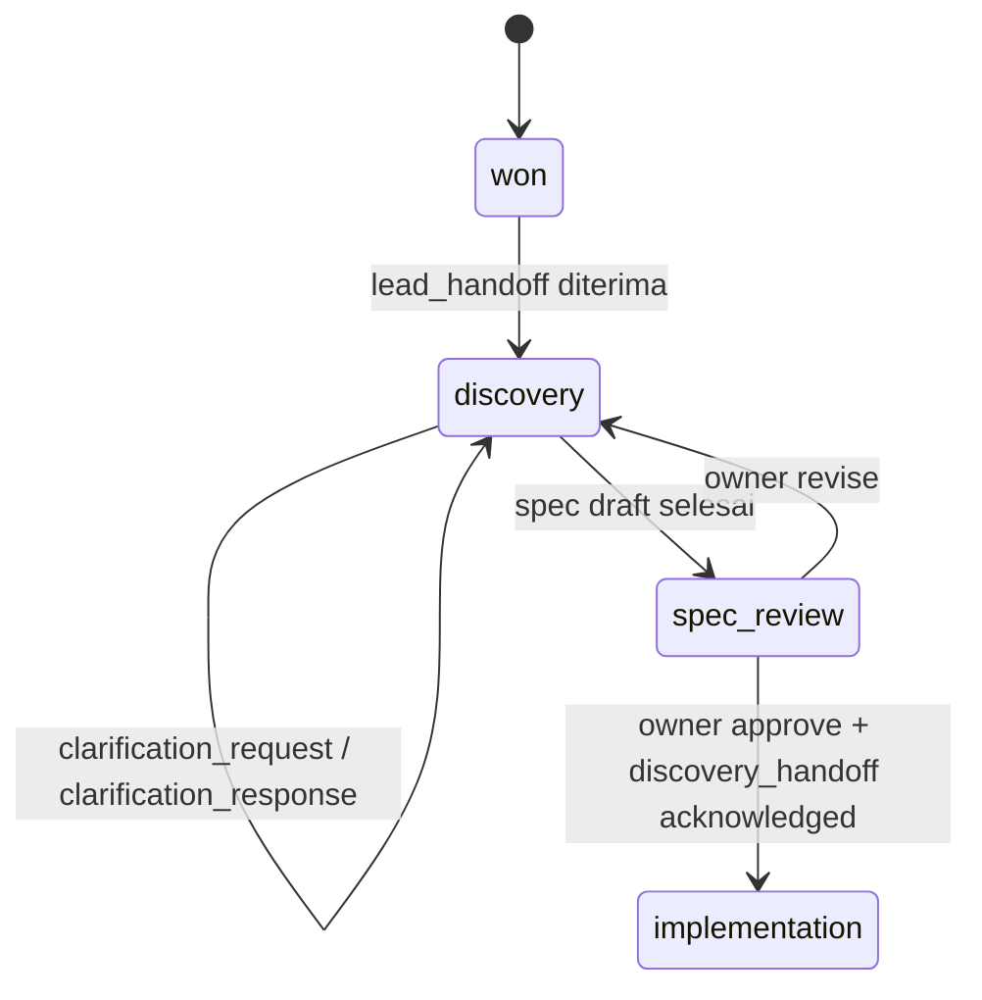
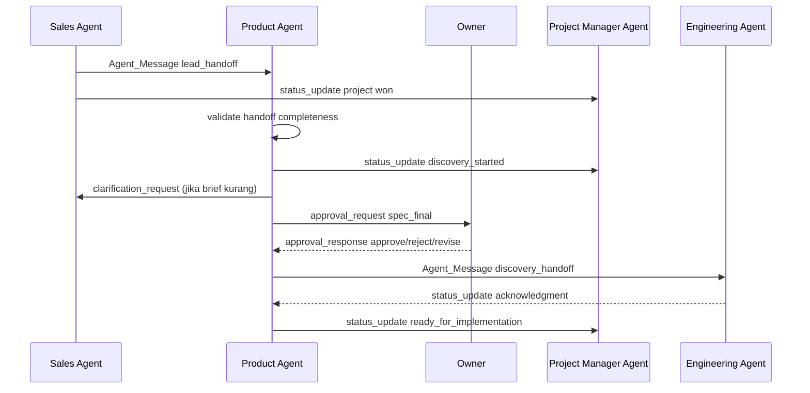

# Design Document

## Product Agent

---

## Overview

Dokumen ini mendeskripsikan desain **Product Agent** sebagai pelaksana fase `discovery` dalam alur AI Company. Desain ini mengacu ke spec induk [ai-company-agents](/home/rny/work/2026/05-mei/agentai01/.kiro/specs/ai-company-agents/requirements.md) dan ke requirements agent ini di [product-agent/requirements.md](/home/rny/work/2026/05-mei/agentai01/.kiro/specs/product-agent/requirements.md).

Peran Product Agent adalah menerima konteks bisnis yang sudah `won`, memvalidasi kelengkapan `lead_handoff`, menjalankan discovery terstruktur, lalu menghasilkan Spec final yang siap masuk ke approval gate Owner dan handoff ke Engineering Agent melalui `discovery_handoff`.

**Prinsip desain utama:**
- Product Agent menjadi sumber kebenaran untuk artefak discovery dan versi Spec selama proyek berada di state `discovery`
- Semua komunikasi lintas agent memakai kontrak `Agent_Message` dari spec induk
- Handoff ke Engineering Agent hanya boleh terjadi setelah approval gate Spec final disetujui Owner
- Klarifikasi, asumsi, risiko, dan gap testability disimpan sebagai histori proyek, bukan percakapan sementara
- Project Manager Agent selalu menerima status penting agar timeline lintas agent tetap sinkron

---

## Architecture

### Lifecycle Placement



### Cross-Agent Flow



---

## Components and Interfaces

### 1. Handoff Intake

Komponen ini memvalidasi `lead_handoff` dari Sales Agent sebelum discovery dimulai. Payload minimum harus mencakup `project_id`, ringkasan bisnis klien, stakeholder, proposal terakhir, scope awal, asumsi komersial, dan risiko awal.

Jika artefak kurang lengkap, Product Agent tidak melanjutkan ke discovery penuh. Agent mengirim `clarification_request` ke Sales Agent dan `status_update` ke Project Manager Agent agar ada jejak blocker awal.

### 2. Discovery Workspace

Discovery Workspace menyimpan seluruh konteks kerja Product Agent pada namespace proyek terisolasi `projects/{client_id}/{project_id}/`. Artefak minimum:

- `discovery-notes.md`
- `clarification-log.json`
- `assumptions.md`
- `risk-register.md`
- `spec-v{version}.md`

Workspace ini menjaga versi artefak agar respons `revise` dari Owner tidak menimpa versi sebelumnya.

### 3. Discovery Orchestrator

Discovery Orchestrator mengelola alur kerja utama Product Agent:

1. Menerima dan memvalidasi `lead_handoff`
2. Menyusun daftar pertanyaan klarifikasi
3. Meringkas kebutuhan bisnis, user persona, integrasi, dan batasan
4. Menyusun capability map dan rekomendasi MVP
5. Mengidentifikasi risiko, gap, dan asumsi
6. Menulis draft Spec
7. Mengajukan approval gate ke Owner
8. Setelah disetujui, mengirim `discovery_handoff` ke Engineering Agent

Setiap tahap dijalankan sebagai `Task` yang statusnya dapat dilacak agar Project Manager Agent dan dashboard induk dapat membaca progres.

### 4. Spec Composer

Spec Composer menghasilkan Spec Markdown yang konsisten dan siap dipakai Engineering Agent. Struktur minimum:

- Ringkasan solusi
- Tujuan bisnis dan ruang lingkup
- Capability map
- Workflow utama atau state flow
- Tool yang dibutuhkan
- Integrasi eksternal
- Acceptance criteria
- Asumsi
- Risiko dan gap
- Rekomendasi MVP vs non-MVP

Composer wajib menyisipkan referensi ke spec induk untuk menjaga konsistensi lifecycle, approval gate, dan kontrak handoff.

### 5. Approval Gate Coordinator

Komponen ini menangani approval gate Spec final. Saat draft final siap, Product Agent mengirim `approval_request` ke Owner yang memuat:

- ringkasan solusi
- scope MVP
- risiko utama
- asumsi penting
- opsi keputusan `approve`, `reject`, atau `revise`

Jika Owner memilih `revise`, status proyek tetap di `discovery` dan versi artefak lama dipertahankan. Jika Owner memilih `approve`, Product Agent boleh melanjutkan `discovery_handoff`.

### 6. Engineering Handoff Publisher

Setelah approval sukses, komponen ini membentuk `Agent_Message` dengan `message_type: "discovery_handoff"` ke Engineering Agent. Payload minimum:

- Spec final
- catatan discovery
- batasan proyek
- prioritas fitur
- acceptance criteria
- daftar tool
- risiko implementasi
- histori approval Spec

Handoff dianggap selesai hanya setelah Engineering Agent mengirim acknowledgment. Sebelum acknowledgment diterima, Project Manager Agent ditandai `awaiting_handoff_ack`.

---

## Message Contracts

### Incoming Messages

| `message_type` | From | Purpose |
|---|---|---|
| `lead_handoff` | Sales Agent | Memulai proyek pada fase discovery |
| `clarification_response` | Sales Agent / Owner | Menjawab pertanyaan discovery |
| `approval_response` | Owner | Menentukan approve/reject/revise Spec |
| `status_update` | Project Manager Agent | Sinkronisasi status koordinasi proyek |

### Outgoing Messages

| `message_type` | To | Purpose |
|---|---|---|
| `clarification_request` | Sales Agent / Owner | Meminta data yang belum lengkap atau konflik |
| `status_update` | Project Manager Agent | Mengirim progres discovery, blocker, dan readiness |
| `approval_request` | Owner | Mengajukan Spec final ke approval gate |
| `discovery_handoff` | Engineering Agent | Mengirim paket implementasi setelah approval |
| `risk_alert` | Project Manager Agent / Owner | Mengeskalasi risiko scope atau dependency |

---

## State and Data Model

### Project State Managed by Product Agent

```json
{
  "project_id": "proj_123",
  "client_id": "client_456",
  "lifecycle_state": "discovery",
  "spec_version": 3,
  "discovery_status": "awaiting_owner_approval",
  "handoff_status": "not_sent",
  "active_risks": [
    {"id": "risk_1", "priority": "high", "type": "technical"}
  ],
  "updated_at": "2026-05-14T10:00:00Z"
}
```

### Internal Task States

- `handoff_validation`
- `discovery_in_progress`
- `awaiting_clarification`
- `spec_drafting`
- `awaiting_owner_approval`
- `awaiting_engineering_ack`
- `handoff_completed`

---

## Failure Handling

### Incomplete `lead_handoff`

Product Agent mengirim `clarification_request` ke Sales Agent dan tidak membuat Spec final sebelum data minimum lengkap.

### Conflicting Inputs

Jika brief, proposal, dan jawaban stakeholder bertentangan, Product Agent menandai konflik di `assumptions.md`, meminta resolusi, dan memberi `risk_alert` ke Project Manager Agent bila berdampak ke timeline.

### Approval Rejected or Revised

Jika Owner mengirim `reject` atau `revise`, Product Agent membuat iterasi baru tanpa menghapus versi lama dan mengirim pembaruan status ke Project Manager Agent.

### Engineering Handoff Not Acknowledged

Jika `discovery_handoff` tidak di-acknowledge dalam SLA internal, Product Agent mengirim reminder lalu eskalasi ke Project Manager Agent sebagai blocker koordinasi.

---

## Coordination Rules

- Product Agent wajib mengirim `status_update` minimal saat discovery dimulai, saat menunggu approval, saat approval diterima, dan saat `discovery_handoff` selesai
- Product Agent tidak mengubah proyek ke `implementation` secara final sebelum acknowledgment dari Engineering Agent tercatat
- Semua approval gate Spec harus terlihat sebagai item pending pada dashboard induk
- Project Manager Agent menerima log milestone `lead_handoff received`, `discovery started`, `spec submitted`, `spec approved`, dan `discovery_handoff completed`
- Engineering Agent menjadi consumer utama Spec, tetapi Product Agent tetap bertanggung jawab atas klarifikasi sampai fase implementasi stabil
