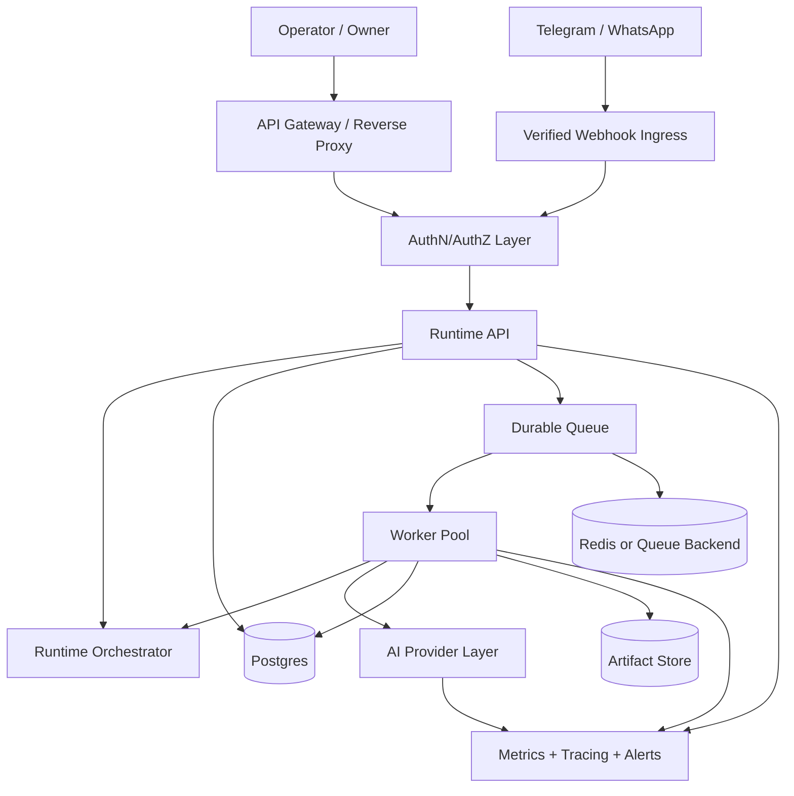

# Design Document

## Production Readiness Hardening

---

## Overview

Dokumen ini mendeskripsikan desain teknis untuk membawa `agentai01` dari runtime prototype lokal menjadi kandidat runtime production yang aman, durable, observable, dan governable.

Fokus desain ini bukan menambah fitur agent baru, tetapi mengeraskan lapisan runtime yang sudah ada:

- `src/runtime-app/*`
- `src/runtime/*`
- `src/registry/*`
- `src/domain/*`
- `src/mcp/*`
- `src/agents/*`

Prinsip desain utama:

- semua surface mutasi harus berada di balik auth boundary yang konsisten
- runtime state tidak boleh bergantung pada seed in-memory
- side effect nyata harus eksplisit, terotorisasi, dan teraudit
- observability harus menjadi bagian dari arsitektur, bukan tambahan belakangan
- surface demo dan live harus dipisahkan secara tegas

---

## Architecture

### High-Level Target Architecture



### Runtime Layers

```text
1. Edge Layer
   - API Gateway / Reverse Proxy
   - Rate limit
   - IP allowlist
   - TLS termination

2. Access Layer
   - Operator authentication
   - Role authorization
   - Webhook signature verification

3. Application Layer
   - Runtime API
   - Approval service
   - Directive service
   - Channel delivery service
   - Recovery service

4. Execution Layer
   - Durable queue
   - Worker pool
   - Scheduler
   - Runtime orchestrator

5. Domain Layer
   - Agents
   - Registry
   - Approval model
   - Message contracts
   - Hierarchy model

6. Infrastructure Layer
   - Postgres
   - Artifact storage
   - Provider adapters
   - Metrics / tracing / alerts
```

---

## Core Design Areas

### 1. Security Boundary

Current runtime utama masih terlalu permisif untuk operasi mutasi. Desain targetnya adalah semua surface mutasi melewati satu boundary yang seragam.

#### Target Control Plane

- server utama hanya expose mutasi yang sudah dilindungi auth
- webhook tidak boleh langsung submit directive tanpa verification
- role dibedakan menjadi:
  - `observer`
  - `operator`
  - `owner`

#### Request Flow

```text
Request
  -> Gateway / Proxy checks
  -> Auth token verification
  -> Role authorization
  -> Input validation
  -> Idempotency / replay guard
  -> Runtime action
  -> Immutable audit append
```

#### Design Decisions

- `OperatorApiServer` dijadikan referensi boundary auth untuk server utama
- fallback token development dihapus dari jalur live
- action mutasi wajib menyertakan actor identity
- webhook provider wajib memiliki signature verification dan replay protection

---

### 2. Persistent Runtime Backbone

Runtime saat ini masih seeded dan in-memory. Target desainnya adalah state operasional utama dipindahkan ke storage durable.

#### Operational Persistence Domains

- runtime metadata
- project state
- approval requests and responses
- job state
- message log
- audit trail
- artifact references
- recovery snapshots

#### Suggested Storage Split

```text
Postgres
  - runtime_instances
  - projects
  - approvals
  - runtime_jobs
  - runtime_messages
  - runtime_audit
  - runtime_checkpoints
  - artifact_refs

Artifact Store
  - project artifacts
  - exports
  - generated summaries
  - recovery attachments
```

#### Design Decisions

- `RuntimeAppState` tidak lagi di-boot dari `createSeed()`
- shell snapshot dibangun dari persisted state
- recovery path harus bisa rebuild pending jobs, approvals, dan message retry state
- audit dan approval writes harus idempotent

---

### 3. Durable Queue And Workers

Queue saat ini belum cukup production-grade. Desain targetnya adalah semua pekerjaan asynchronous penting memakai queue durable.

#### Job Classes

- directive execution
- message dispatch
- approval follow-up
- failed message retry
- failed job retry
- webhook delivery follow-up
- report generation
- recovery replay

#### State Machine

```text
queued -> running -> completed
       -> running -> failed -> retrying -> running
       -> failed -> dead_lettered
```

#### Design Decisions

- queue backend dapat memakai Postgres-backed queue atau Redis/BullMQ
- retry budget harus eksplisit per job type
- dead-letter queue wajib ada untuk failure permanen
- worker heartbeat dan stuck-job scanner wajib tersedia

---

### 4. Real Channel Integration

Channel send endpoints tidak boleh hanya mencatat log. Mereka harus benar-benar melakukan delivery dan bisa diaudit.

#### Telegram / WhatsApp Delivery Flow

```text
Runtime action
  -> validate recipient / payload
  -> enqueue delivery job
  -> provider adapter send
  -> persist delivery result
  -> emit audit + metrics
```

#### Webhook Ingress Flow

```text
Webhook request
  -> verify signature
  -> verify timestamp / replay window
  -> deduplicate event id
  -> normalize payload
  -> authorize route behavior
  -> enqueue processing job
```

#### Design Decisions

- outbound send dipisah dari inbound webhook processing
- webhook tidak boleh langsung mutate runtime synchronously tanpa guard
- delivery provider adapter harus mengembalikan structured result dan error classes

---

### 5. Provider Reliability Layer

Provider AI production harus diperlakukan sebagai dependency yang tidak stabil dan berbiaya.

#### Reliability Controls

- request timeout classes
- retry policy terukur
- quota/rate-limit awareness
- fallback model matrix
- circuit breaker untuk upstream failure spike
- correlation id propagation

#### Design Decisions

- operator chat, specialist runtime, dan generation flows bisa memiliki timeout budget berbeda
- fallback model tidak boleh diam-diam mengubah behavior tanpa audit event
- provider failures harus bisa dibedakan: auth, timeout, rate limit, upstream 5xx, bad response

---

### 6. Observability

Observability harus menyatukan HTTP request, runtime action, queue job, provider call, dan channel event.

#### Telemetry Domains

- request logs
- mutation audit
- queue/job metrics
- provider metrics
- channel delivery metrics
- auth failure metrics
- webhook verification failures

#### Minimum Metrics

- API request latency
- provider latency
- queue lag
- retry counts
- failed approvals
- dead-letter count
- auth failure spike
- webhook error rate

#### Trace Spine

```text
correlation_id
  -> HTTP request
  -> directive / approval action
  -> queue job
  -> worker execution
  -> provider/tool call
  -> audit entry
```

#### Design Decisions

- structured logs menjadi default output
- metrics dan tracing harus tersedia lintas process
- alerting minimum difokuskan ke dependency dan stuck workflow

---

### 7. Product And Runtime Governance

Tidak semua agent boleh langsung memicu side effect nyata.

#### Side Effect Classes

- read-only observation
- low-risk internal mutation
- external message delivery
- workspace mutation
- client-facing artifact mutation
- high-risk operational action

#### Governance Model

- `observer` hanya read-only
- `operator` boleh menjalankan operasi terkontrol
- `owner` wajib approve aksi high-risk
- beberapa side effect harus melewati explicit approval gate

#### Design Decisions

- `allowedMcpTools` tetap menjadi boundary penting
- untuk domain healthcare atau banking, masking, PII handling, dan retention policy dianggap mandatory
- approval gate harus bisa menjelaskan siapa yang meminta, siapa yang menyetujui, dan konteks apa yang dipakai

---

## Migration Strategy

### Phase 0: Hardening Minimum

- samakan auth boundary server utama dengan `OperatorApiServer`
- hapus fallback token development
- protect mutating webhooks
- tandai demo/live mode dengan tegas

### Phase 1: Durable Runtime

- ganti seeded state dengan database-backed state
- persist approvals, jobs, messages, audit, artifacts
- tambahkan recovery bootstrap

### Phase 2: Production Channels And Workers

- real outbound delivery
- verified inbound webhook
- durable queue + dead-letter queue

### Phase 3: Ops And Scale

- metrics
- tracing
- alerting
- load test
- soak test
- security review

---

## Validation Strategy

### Test Layers

- unit tests untuk auth, idempotency, webhook verification, retry policy
- integration tests untuk Runtime API + queue + persistence
- recovery tests untuk restart scenario
- provider reliability tests untuk timeout, fallback, dan circuit breaker
- channel tests untuk signed webhook, deduplication, dan delivery result

### Production Readiness Gates

- no default auth fallback
- no mutating endpoint without auth
- no seeded runtime state in live mode
- restart recovery proven in automated test
- queue dead-letter behavior proven
- observability surface exposed and verified

---

## Risks And Tradeoffs

- menambah boundary auth akan memperlambat iterasi development jika demo/live tidak dipisah dengan rapi
- durable queue menambah kompleksitas operasional, tapi ini wajib untuk reliability
- provider fallback meningkatkan availability, tetapi bisa mengubah quality/output sehingga perlu auditability
- compliance-oriented masking dan retention bisa menambah friction, tetapi ini lebih murah daripada remediation setelah incident

---

## Conclusion

Desain hardening production untuk `agentai01` berfokus pada perubahan fondasi runtime, bukan polish UI atau prompt semata. Kunci suksesnya adalah:

- security-first mutation boundary
- durable state and queue
- real channel and provider integrations
- observability by design
- runtime governance yang jelas

Dokumen ini menjadi pedoman arsitektur untuk implementasi bertahap menuju runtime production.
