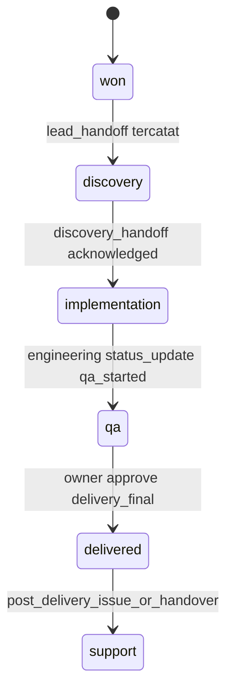
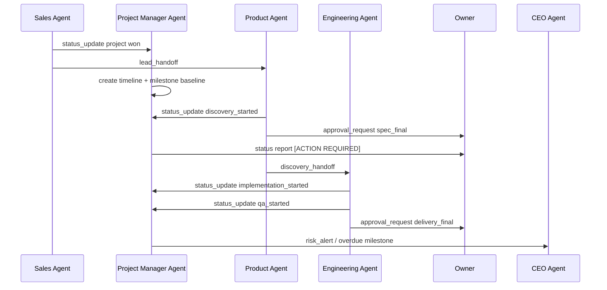

# Design Document

## Project Manager Agent

---

## Overview

Dokumen ini mendeskripsikan desain **Project Manager Agent** sebagai lapisan koordinasi operasional lintas agent dalam AI Company. Desain ini merujuk ke spec induk [ai-company-agents](/home/rny/work/2026/05-mei/agentai01/.kiro/specs/ai-company-agents/requirements.md) dan requirements [project-manager-agent/requirements.md](/home/rny/work/2026/05-mei/agentai01/.kiro/specs/project-manager-agent/requirements.md).

Project Manager Agent tidak menjadi pelaksana discovery atau coding. Agent ini menjaga proyek tetap on-track sejak `won`, mencatat milestone `lead_handoff` dan `discovery_handoff`, memantau transisi `discovery -> implementation -> qa -> delivered`, mengelola blocker dan risiko, serta memastikan approval gate terlihat jelas oleh Owner dan CEO Agent.

**Prinsip desain utama:**
- Project Manager Agent menjadi sumber kebenaran operasional untuk timeline, milestone, blocker, dan status lintas fungsi
- Agent harus pasif terhadap isi artefak teknis, tetapi aktif terhadap status, dependensi, dan SLA handoff
- Semua perubahan status penting harus dapat dilihat sebagai history proyek yang persisten
- Approval gate tidak diputuskan oleh Project Manager Agent, tetapi harus dipantau dan dieskalasi bila macet
- Koordinasi lintas agent lebih penting daripada eksekusi detail agent individual

---

## Architecture

### Lifecycle Placement



### Cross-Agent Coordination Flow



---

## Components and Interfaces

### 1. Project Intake and Timeline Planner

Saat proyek baru `won`, komponen ini membuat `Project_Timeline` awal berdasarkan data Sales Agent dan target delivery. Timeline minimum memuat:

- milestone
- owner agent per milestone
- deadline
- dependency utama
- approval gate terkait

Milestone wajib yang dilacak sejak awal:

- `project_created`
- `lead_handoff_sent`
- `discovery_started`
- `spec_approval_pending`
- `discovery_handoff_sent`
- `implementation_started`
- `qa_started`
- `delivery_approval_pending`
- `delivered`

### 2. Lifecycle Tracker

Lifecycle Tracker menjadi penerjemah semua `status_update` dan handoff ke state proyek yang konsisten. Tracker harus memahami state induk:

- `won`
- `discovery`
- `implementation`
- `qa`
- `delivered`
- `support`

Project Manager Agent tidak memaksa perubahan state sendiri tanpa event pemicu dari agent pelaksana, tetapi memvalidasi apakah transisinya legal sesuai spec induk.

### 3. Handoff Monitor

Komponen ini memantau dua handoff inti:

- `lead_handoff` dari Sales Agent ke Product Agent
- `discovery_handoff` dari Product Agent ke Engineering Agent

Untuk tiap handoff, Handoff Monitor menyimpan:

- timestamp pengiriman
- agent pengirim
- agent penerima
- status acknowledgment
- SLA acknowledgment
- blocker jika belum lengkap

Jika acknowledgment terlambat, agent ini mengirim reminder dan dapat mengeskalasi ke CEO Agent atau Owner sesuai severity.

### 4. Blocker and Risk Registry

Registry ini mencatat blocker operasional, keterlambatan, dependency yang tertahan, dan approval gate yang belum bergerak. Atribut minimum:

- `blocker_id`
- `project_id`
- `severity`
- `affected_agents`
- `root_cause`
- `recommended_action`
- `opened_at`
- `resolved_at`

Risk Registry juga menyimpan penanda `at_risk` bila milestone melewati deadline atau approval gate pending terlalu lama.

### 5. Status Reporter

Status Reporter menghasilkan dua mode keluaran utama:

- `status <project_id>` untuk snapshot cepat
- `history <project_id>` untuk timeline kejadian proyek

Laporan periodik ke Owner dan CEO Agent menyoroti:

- lifecycle state aktif
- milestone aktif
- blocker terbuka
- approval gate pending
- estimasi next step

Jika proyek memerlukan keputusan manusia, laporan harus diberi label `[ACTION REQUIRED]`.

### 6. Coordination Task Engine

Pekerjaan asinkron seperti reminder status, pengecekan SLA acknowledgment, dan eskalasi blocker dimodelkan sebagai `Task` yang dapat diinspeksi. Engine ini memastikan Project Manager Agent dapat pulih setelah restart tanpa kehilangan state proyek aktif.

---

## Message Contracts

### Incoming Messages

| `message_type` | From | Purpose |
|---|---|---|
| `status_update` | Sales/Product/Engineering/Support Agent | Memperbarui milestone dan lifecycle proyek |
| `lead_handoff` | Sales Agent | Menandai perpindahan dari won ke discovery |
| `discovery_handoff` | Product Agent | Menandai readiness transisi ke implementation |
| `approval_request` | Product/Engineering Agent | Mendaftarkan approval gate pending |
| `approval_response` | Owner | Menutup atau mengulang approval gate |
| `risk_alert` | Agent lain | Menambah isu ke registry risiko |

### Outgoing Messages

| `message_type` | To | Purpose |
|---|---|---|
| `status_update` | Owner / CEO Agent | Mengirim ringkasan status proyek |
| `clarification_request` | Agent terkait | Meminta update atau artefak status yang hilang |
| `risk_alert` | CEO Agent / Owner | Mengeskalasi blocker berat atau milestone terlambat |
| `status_update` | Product / Engineering Agent | Reminder milestone atau acknowledgment yang tertunda |

---

## State and Data Model

### Project Coordination State

```json
{
  "project_id": "proj_123",
  "client_id": "client_456",
  "lifecycle_state": "discovery",
  "current_milestone": "spec_approval_pending",
  "milestone_status": "at_risk",
  "pending_approvals": ["spec_final"],
  "open_blockers": 1,
  "updated_at": "2026-05-14T11:00:00Z"
}
```

### Milestone Record

```json
{
  "milestone_id": "discovery_handoff_sent",
  "project_id": "proj_123",
  "owner_agent": "product",
  "depends_on": ["spec_final_approved"],
  "status": "awaiting_ack",
  "due_at": "2026-05-15T09:00:00Z"
}
```

---

## Failure Handling

### Missing Status Updates

Jika Product Agent atau Engineering Agent tidak mengirim pembaruan status dalam interval yang diharapkan, Project Manager Agent mengirim reminder lalu menaikkan isu menjadi blocker operasional.

### Illegal Lifecycle Transition

Jika ada agent mencoba melompati state, misalnya `discovery` langsung ke `qa`, Lifecycle Tracker menolak transisi, mencatat audit log, dan mengeskalasi ke CEO Agent.

### Approval Gate Stalled

Jika approval gate Spec final atau delivery final terlalu lama tertahan, Project Manager Agent tidak mengubah keputusan, tetapi mengirim laporan `[ACTION REQUIRED]` ke Owner dan memberi sinyal risiko jadwal.

### Handoff Without Acknowledgment

Jika `lead_handoff` atau `discovery_handoff` tidak di-acknowledge dalam SLA, Handoff Monitor menandai milestone `at_risk` dan mencatat blocker lintas agent.

---

## Coordination Rules

- Project Manager Agent harus mencatat `lead_handoff` dan `discovery_handoff` sebagai milestone eksplisit, bukan sekadar log biasa
- Approval gate `spec_final` dan `delivery_final` harus tercermin sebagai item pending pada timeline proyek
- Status proyek ke Owner harus menggabungkan konteks komersial, produk, engineering, dan support bila relevan
- Project Manager Agent tidak boleh menimpa state artefak Product atau Engineering, hanya mencatat dan memvalidasi progres
- Dashboard induk harus dapat membaca state proyek, approval pending, milestone aktif, dan blocker dari data Project Manager Agent
