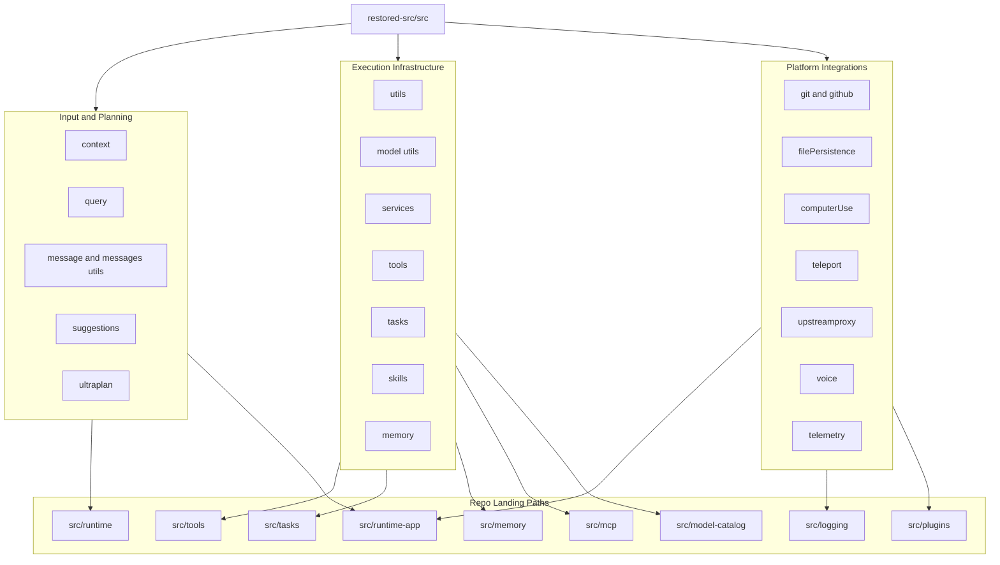

# Design Document

## Restored Src Modules Adaptation

---

## Overview

Spec ini mendesain adopsi menyeluruh capability dari `restored-src/src/` ke repo `agentai01`. Fokusnya bukan menyalin tree sumber apa adanya, tetapi memetakan semua capability yang sudah dianggap relevan ke boundary repo saat ini.

Prinsip desain:

1. semua capability yang diminta tetap masuk scope
2. struktur target mengikuti arsitektur repo ini, bukan bentuk folder referensi
3. capability baru ditempatkan sedekat mungkin dengan subsystem existing yang sudah relevan
4. migrasi harus bisa bertahap dan tidak memaksa rewrite total

---

## Architecture

### Capability Mapping Model



### Source to Landing Strategy

| Source capability | Primary landing path | Notes |
|---|---|---|
| `context/*` | `src/runtime-app/ui`, `src/interactive`, `src/runtime` | Banyak source file berupa UI context `.tsx`, jadi jangan dipaksa jadi core domain |
| `query/*` | `src/runtime`, `src/context-engine`, `src/runtime-app/prompt` | Fokus ke preprocessing, stop hooks, token budget |
| `message/*` dan `utils/messages/*` | `src/runtime`, `src/shared`, `src/tools` | Untuk normalization dan helper runtime message |
| `suggestions/*` dan `services/PromptSuggestion/*` | `src/runtime-app/prompt`, `src/tools`, `src/plugins` | Prompt suggestion dan autocomplete |
| `utils/model/*` | `src/model-catalog`, `src/runtime-app/providers` | Resolver, capability, alias, fallback |
| `services/api/*` | `src/runtime-app/providers`, `src/runtime` | Retry, parsing, request lifecycle |
| `services/mcp/*` | `src/mcp`, `src/runtime-app/integrations/mcp` | Connection manager, auth, transport |
| `tools/*` | `src/tools`, `src/runtime-app/tools` | Tool contract dan integration layer |
| `tasks/*` | `src/tasks`, `src/runtime-app/queue`, `src/runtime` | Background execution dan lifecycle |
| `skills/*` | `src/runtime-app/skills`, `src/plugins`, `src/agents` | Discovery dan execution path |
| `memory/*`, `services/SessionMemory/*`, `services/teamMemorySync/*` | `src/memory`, `src/runtime-app/memory` | Session memory dan sync boundaries |
| `utils/git/*`, `utils/github/*` | `src/runtime-app/integrations/github`, `src/shared` | Repo helpers dan auth/status integration |
| `utils/filePersistence/*` | `src/memory`, `src/runtime-app/storage` | State/artifact persistence |
| `utils/computerUse/*` | `src/runtime-app/tools`, `src/runtime` | Automation safety dan host adapter |
| `upstreamproxy/*` | `src/runtime-app/providers`, `src/gateway`, `src/http` | Relay dan upstream boundary |
| `voice/*` | `src/runtime-app/speech`, `src/tts`, `src/realtime-transcription` | Voice feature flags dan speech integration |
| `utils/telemetry/*`, `services/analytics/*` | `src/logging`, `src/runtime-app/diagnostics` | Eventing, tracing, exporter |
| `utils/teleport/*` | `src/runtime-app/extensions`, `src/runtime` | Export/teleport session or environment |
| `utils/ultraplan/*` | `src/tools`, `src/tasks`, `src/runtime` | Planning helper, not separate runtime |

---

## Design Principles

### 1. Capability First, Folder Second

Beberapa capability yang diminta user memang tidak selalu hidup sebagai top-level folder di `restored-src/src/`. Karena itu desain ini memakai prinsip:

- petakan capability dulu
- baru tentukan target folder di repo ini

Contohnya:

- `model/*` terutama bersumber dari `restored-src/src/utils/model/*`
- `message/*` banyak bersumber dari `restored-src/src/utils/messages/*` dan tipe message shared
- `telemetry/*` tersebar di `utils/telemetry/*`, `services/analytics/*`, dan init hooks

### 2. Strengthen Existing Subsystems

Repo ini sudah punya pondasi yang relevan:

- `src/tools`
- `src/tasks`
- `src/memory`
- `src/logging`
- `src/mcp`
- `src/model-catalog`
- `src/runtime`
- `src/runtime-app`

Karena itu desain ini memilih:

- extend subsystem yang sudah ada bila overlap tinggi
- buat compatibility adapters bila naming atau contract berbeda
- hindari membuat subsistem kembar dengan tanggung jawab yang sama

### 3. Protect the 4-Tier Agent Hierarchy

Adaptasi tidak boleh merusak:

- `src/domain/hierarchy.ts`
- `SubAgentRegistry`
- `BatonPassingOrchestrator`
- isolasi scratchpad antar departemen

Capability seperti `swarm`, `AgentTool`, `SendMessageTool`, `team memory`, dan `tasks` harus ditafsirkan sebagai penguat orkestrasi yang ada, bukan pengganti arsitektur agent hierarki repo ini.

### 4. Service Contracts Before UX Polish

Banyak modul `restored-src` punya lapisan UI `.tsx`. Untuk repo ini, desain memprioritaskan:

1. contract dan business-safe helpers
2. runtime integration
3. baru operator surface atau UI support bila masih relevan

---

## Components and Interfaces

### 1. Input and Reasoning Pipeline

Cluster ini menggabungkan:

- `query/*`
- `utils/processUserInput/*`
- `utils/messages/*`
- `utils/suggestions/*`
- `services/PromptSuggestion/*`
- bagian runtime-relevant dari `context/*`

Peran:

- membersihkan input user
- normalisasi message structure
- hitung token budget
- tambahkan suggestion/prompt assist
- siapkan payload ke model/tools/tasks

Conceptual flow:

```text
user input
  -> processUserInput
  -> query normalization
  -> message helpers
  -> token budget and stop hooks
  -> suggestion enrichment
  -> runtime execution
```

### 2. Utility and Model Core

Cluster ini mencakup:

- `utils/permissions`
- `utils/bash`
- `utils/shell`
- `utils/settings`
- `utils/model`
- `utils/secureStorage`
- `utils/mcp`
- `utils/task`
- `utils/hooks`
- `utils/swarm`
- `utils/git`
- `utils/github`
- `utils/filePersistence`
- `utils/telemetry`
- `utils/teleport`
- `utils/ultraplan`

Peran:

- menyediakan leaf helpers untuk seluruh runtime
- menjaga command/file/network safety
- menyatukan model metadata dan provider capability
- menjadi fondasi untuk tool execution dan service orchestration

Sample contract direction:

```ts
type ModelResolution = {
  requestedModel?: string
  resolvedModel: string
  providerId: string
  supportsTools: boolean
  supportsStreaming: boolean
}

type PermissionDecision =
  | { allowed: true; reason: string }
  | { allowed: false; reason: string }
```

### 3. Service Layer

Cluster ini mencakup:

- `services/api`
- `services/mcp`
- `services/analytics`
- `services/compact`
- `services/lsp`
- `services/plugins`
- `services/settingsSync`
- `services/remoteManagedSettings`
- `services/SessionMemory`
- `services/teamMemorySync`
- `services/PromptSuggestion`
- `services/MagicDocs`
- `services/toolUseSummary`

Peran:

- menyembunyikan kompleksitas provider, MCP, analytics, compaction, dan sync
- memberi runtime-app service boundary yang eksplisit
- membuat fitur lanjutan bisa aktif bertahap lewat dependency injection

Important integration rules:

- `services/api` tidak langsung mengikat ke satu provider
- `services/mcp` reuse policy dari `src/mcp`
- `services/teamMemorySync` wajib patuh pada project/department isolation
- `services/analytics` dan `toolUseSummary` wajib lewat redaction-safe logging path

### 4. Tool Catalog

Cluster ini mencakup seluruh tool penting yang disebut user.

Tool dibagi menjadi beberapa kelompok:

- shell and file: `BashTool`, `PowerShellTool`, `FileReadTool`, `FileWriteTool`, `FileEditTool`
- search and discovery: `GrepTool`, `GlobTool`, `WebFetchTool`, `WebSearchTool`
- runtime integration: `MCPTool`, `ListMcpResourcesTool`, `ReadMcpResourceTool`, `McpAuthTool`, `LSPTool`
- coordination: `AgentTool`, `SendMessageTool`, `Task*`, `SkillTool`, `TodoWriteTool`
- workflow mode control: `EnterPlanModeTool`, `ExitPlanModeTool`, `EnterWorktreeTool`, `ExitWorktreeTool`
- specialty: `NotebookEditTool`

Desain katalog:

```ts
type ToolDescriptor = {
  toolName: string
  category: string
  requiresApproval: boolean
  inputSchemaId: string
  outputKind: "json" | "text" | "mixed"
}
```

### 5. Execution Fabric

Cluster ini menggabungkan:

- `tasks/*`
- `skills/*`
- `memory/*`
- `services/SessionMemory/*`
- `services/teamMemorySync/*`

Peran:

- menjalankan task sinkron dan asinkron
- mendukung task lokal, shell, teammate, dan remote
- memuat skill bundled maupun custom
- menyimpan state kerja yang perlu dipertahankan antar turn

Execution flow:

```text
tool or runtime request
  -> task creation
  -> capability guard
  -> execution path
  -> memory/session update
  -> telemetry and summary
```

### 6. Platform Integrations

Cluster ini mencakup:

- `utils/git`
- `utils/github`
- `utils/filePersistence`
- `utils/computerUse`
- `upstreamproxy/*`
- `voice/*`
- `utils/teleport`
- `utils/ultraplan`

Peran:

- menghubungkan runtime dengan repo state, remote services, UI automation, speech, dan export flows
- menyediakan optional capability yang bisa diaktifkan bertahap

Design note:

- `computerUse` harus dianggap high-risk capability dan selalu punya gate
- `upstreamproxy` harus ditempatkan di boundary network, bukan di agent domain
- `voice` harus jadi feature flag di sekitar speech stack existing

---

## Integration Plan

### Batch 1: Baseline and Mapping

- inventaris source capability final
- landing path map
- rules untuk coexistence dan compatibility adapters

### Batch 2: Input, Message, Query, Suggestions

- `query`
- `processUserInput`
- `messages`
- `suggestions`
- runtime-safe pieces of `context`

### Batch 3: Utility and Model Core

- permissions
- bash and shell safety
- settings
- model resolution
- secure storage
- telemetry helpers
- file persistence helpers

### Batch 4: Services Layer

- api
- mcp
- analytics
- compact
- lsp
- settings sync
- remote managed settings
- plugin services
- session and team memory services

### Batch 5: Tools

- shell and file tools
- discovery tools
- MCP and LSP tools
- task, skill, todo, and mode/worktree tools

### Batch 6: Tasks, Skills, Memory

- task executor patterns
- skill discovery and execution
- memory/session integration

### Batch 7: Platform Integrations

- git and GitHub
- computer use
- teleport
- ultraplan
- upstream proxy
- voice flag integration

### Batch 8: Runtime-App Integration

- wire services and tools into `src/runtime-app/*`
- add compatibility layers
- avoid circular dependencies

### Batch 9: Validation

- typecheck
- behavior tests
- smoke verification for affected runtime surfaces

---

## Risks and Mitigations

### Risk 1: Parallel Architecture Drift

Jika capability baru di-copy mentah, repo akan punya dua cara melakukan hal yang sama.

Mitigasi:

- wajib ada Landing_Path map
- prefer extend subsystem existing
- compatibility wrappers untuk transisi

### Risk 2: UI-Centric Code Masuk ke Core Runtime

Beberapa source `context/*` dan `tools/*` punya komponen `.tsx`.

Mitigasi:

- ekstrak contract dan helper lebih dulu
- UI-only parts dipindah ke operator surfaces bila benar-benar dibutuhkan

### Risk 3: Security Regression

Capability seperti shell execution, MCP, web fetch, computer use, dan remote sync berisiko tinggi.

Mitigasi:

- reuse `src/security/`, `src/secrets/`, `src/logging/`
- explicit path validation and permission gating
- no raw secret logging

### Risk 4: Hierarchy Conflict

Capability swarm/agent tools dapat bertabrakan dengan baton-passing hierarchy existing.

Mitigasi:

- semua multi-agent capability harus duduk di atas `SubAgentRegistry` dan runtime orchestration yang sudah ada
- jangan introduce parent-child model baru yang konflik

---

## Validation Strategy

Setiap batch implementasi yang nanti mengikuti spec ini harus membuktikan:

- source capability yang diadopsi jelas
- landing path di repo sekarang jelas
- contract security dijaga
- test minimal tersedia
- `npm run check` dan `bun test` tetap hijau

Untuk batch yang menyentuh provider/runtime paths, validasi ditambah dengan:

- `npm run runtime:smoke`

Spec ini sengaja disusun sebagai blueprint implementasi, bukan checklist yang sudah selesai.
