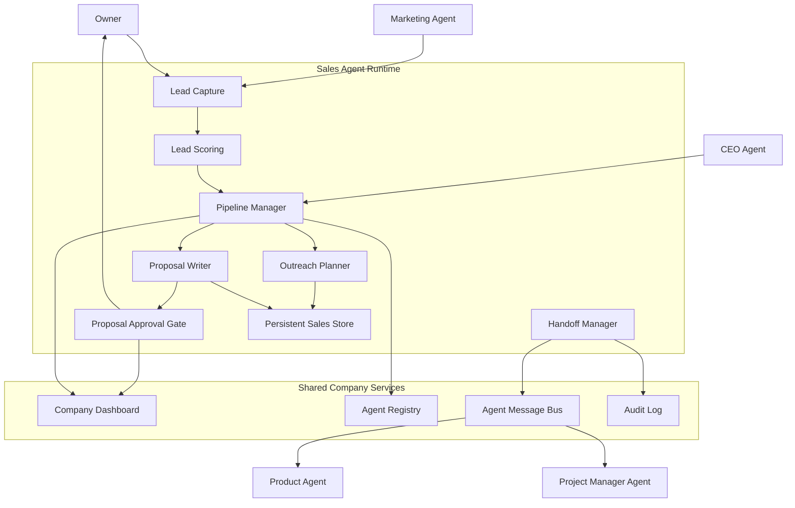
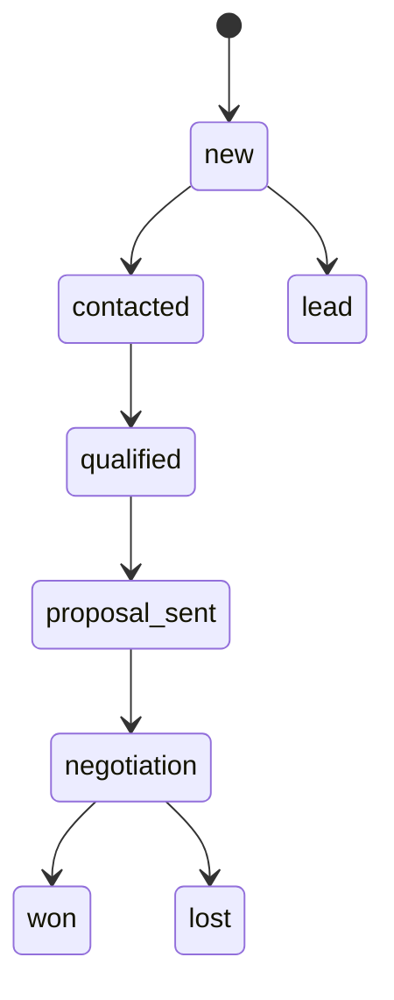
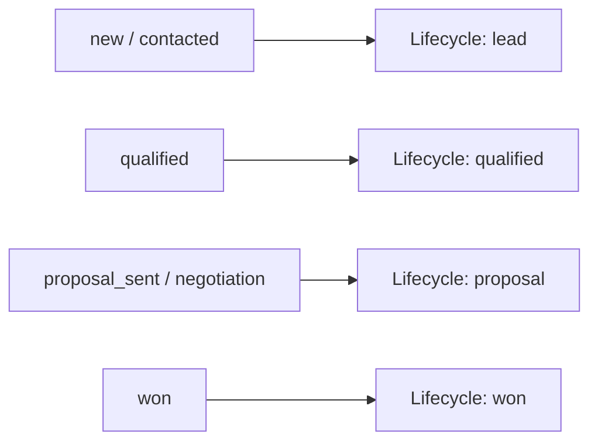
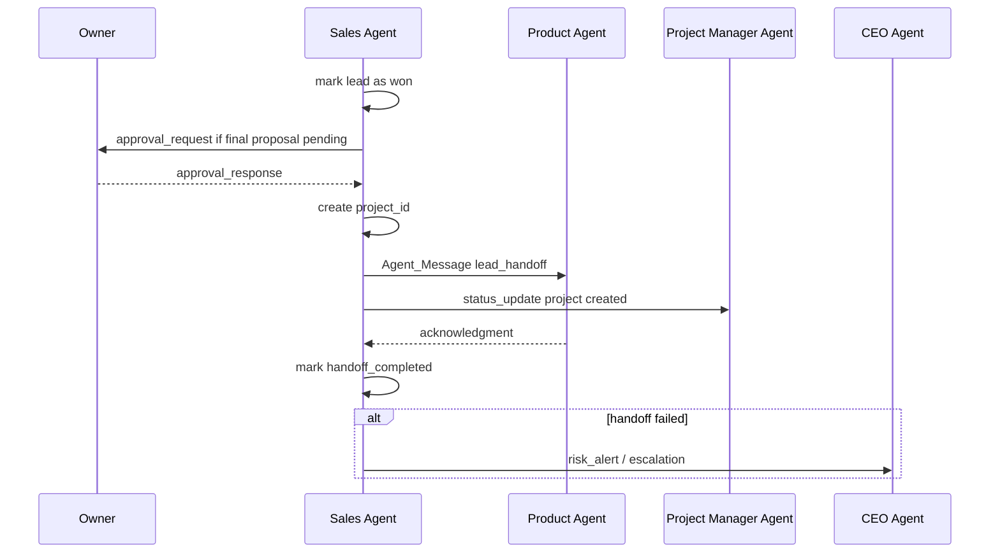

# Design Document

## Sales Agent

---

## Overview

Fitur ini mendefinisikan desain **Sales Agent** sebagai mesin pipeline komersial dalam AI Company. Sales Agent menerima lead, mengelola outreach dan follow-up, menilai kualifikasi, menyusun proposal, mengajukan `Approval_Gate` proposal final ke Owner, dan melakukan handoff formal ke Product Agent ketika deal berpindah ke delivery.

Sales Agent harus kompatibel dengan spec induk dan menjaga kesinambungan antara `Pipeline_Stage` internal sales dan `Lifecycle_State` global perusahaan. Agent ini juga menjadi sumber konteks bisnis utama untuk `lead_handoff`.

**Prinsip desain utama:**
- semua lead memiliki timeline, skor kualifikasi, dan histori perubahan stage
- `Pipeline_Stage` sales harus tersinkron dengan `Lifecycle_State` global
- proposal final tidak boleh dikirim ke klien tanpa `Approval_Gate`
- handoff ke Product Agent harus menggunakan `message_type: "lead_handoff"`
- Sales Agent harus memberi visibilitas ke CEO Agent dan Project Manager Agent melalui dashboard, registry, dan message log

---

## Architecture

### System Architecture Diagram



### Sales Lifecycle Flow



### Stage Mapping to Global Lifecycle



### Lead Handoff Flow



---

## Components and Interfaces

### 1. Lead Capture

`Lead_Capture` menerima lead dari Owner, Marketing Agent, atau sumber inbound lain. Data minimum:

```ts
type Lead = {
  lead_id: string
  company_name: string
  primary_contact: string
  industry: string
  source: string
  initial_need: string
}
```

Setiap lead langsung:

- dibuat timeline awal
- diberi `Pipeline_Stage: new`
- diselaraskan ke `Lifecycle_State: lead`

### 2. Lead Scoring

`Lead_Scoring` menghitung skor kualifikasi berdasarkan:

- urgency
- budget fit
- authority
- use-case relevance

Hasil scoring dipakai untuk:

- menandai lead `low_priority` bila di bawah threshold
- menentukan apakah lead dapat dipindahkan ke `qualified`
- memberi konteks bagi CEO Agent dan Owner di dashboard

### 3. Pipeline Manager

`Pipeline_Manager` mengelola lifecycle internal sales:

```ts
type PipelineStage =
  | "new"
  | "contacted"
  | "qualified"
  | "proposal_sent"
  | "negotiation"
  | "won"
  | "lost"
```

Aturan sinkronisasi ke global lifecycle:

- `new` / `contacted` -> `lead`
- `qualified` -> `qualified`
- `proposal_sent` / `negotiation` -> `proposal`
- `won` -> `won`

Pipeline manager juga menyimpan histori perubahan stage dan timestamp pengiriman proposal.

### 4. Outreach Planner

`Outreach_Planner` menghasilkan draft:

- kontak awal
- follow-up nilai tambah
- penutupan loop

Planner membaca:

- profil industri lead
- pain point utama
- preferensi gaya komunikasi Owner
- insight segment dari Marketing Agent

Hasil draft disimpan ke timeline lead untuk audit dan reuse.

### 5. Proposal Writer

`Proposal_Writer` menyusun proposal awal untuk lead yang sudah `qualified`.

Isi minimum proposal:

- ringkasan kebutuhan
- outcome bisnis
- ruang lingkup awal
- estimasi timeline
- kisaran harga
- asumsi
- item `[NEEDS_SCOPING]`

Lokasi penyimpanan proposal:

```text
{lead_id}/proposal-v{version}.md
```

### 6. Proposal Approval Gate

Sebelum proposal final dikirim ke klien, Sales Agent harus mengajukan `Approval_Gate` ke Owner. Approval request membawa:

- versi proposal terakhir
- ringkasan perubahan dari versi sebelumnya
- rekomendasi kirim / revisi
- risiko komersial
- bagian yang masih bertag `[NEEDS_SCOPING]`

Status approval harus terlihat di `Company_Dashboard` agar CEO Agent dapat memantau bottleneck komersial.

### 7. Handoff Manager

Ketika lead menjadi `won` atau discovery berbayar disetujui, `Handoff_Manager` membuat `project_id` dan mengirim `Agent_Message` `lead_handoff` ke Product Agent.

Format minimum:

```json
{
  "from": "sales-agent",
  "to": "product-agent",
  "lead_id": "lead-001",
  "project_id": "proj-001",
  "message_type": "lead_handoff",
  "payload": {
    "business_summary": "",
    "pain_points": [],
    "stakeholders": [],
    "conversation_notes": [],
    "last_proposal_ref": "",
    "commercial_risks": []
  }
}
```

Handoff juga harus:

- memberi notifikasi ke Project Manager Agent
- menunggu acknowledgment Product Agent
- menandai `handoff_completed` bila sukses
- mengeskalasi ke CEO Agent atau Owner bila gagal

---

## Tool Design

Sales Agent mengikuti pola `AgentDefinition`, `buildTool`, `Task`, dan `QueryEngine`.

### Tool Inventory

| Tool | Purpose |
|------|---------|
| `lead_capture` | Menyimpan dan menginisialisasi lead baru |
| `lead_score` | Menghitung skor kualifikasi lead |
| `proposal_write` | Menyusun atau merevisi proposal |
| `message_send` | Mengirim outreach, follow-up, atau handoff terstruktur |
| `pipeline_update` | Mengubah stage pipeline dan sinkronisasi lifecycle |

### Agent Definition Sketch

```ts
const salesAgentDefinition = {
  agentType: "sales",
  description: "Pipeline, proposal, and deal handoff manager for AI Company",
  tools: [
    "lead_capture",
    "lead_score",
    "proposal_write",
    "message_send",
    "pipeline_update"
  ],
  systemPrompt: "Qualify leads, move the pipeline, prepare proposals, request approval, and hand off won deals cleanly."
}
```

### Async Tasks

Pekerjaan asinkron yang perlu dimodelkan sebagai `Task`:

- follow-up terjadwal
- proposal revision cycle
- handoff acknowledgment wait

---

## Operational Flows

### Flow 1: Lead Intake and Qualification

1. Lead masuk dari Owner atau Marketing Agent.
2. Sales Agent menyimpan data lead minimum.
3. `Lead_Scoring` menghitung skor dan menghasilkan pertanyaan klarifikasi bila data kurang.
4. `Pipeline_Manager` memindahkan lead ke `qualified` bila threshold terpenuhi.
5. Sinkronisasi ke `Lifecycle_State` global diperbarui di registry/dashboard.

### Flow 2: Proposal Lifecycle

1. Lead `qualified` memicu pembuatan proposal draft.
2. Proposal disimpan sebagai versi baru tanpa menghapus versi lama.
3. Sales Agent mengajukan `Approval_Gate` proposal final ke Owner.
4. Jika disetujui, proposal dikirim ke klien dan stage menjadi `proposal_sent`.
5. Jika ditolak atau `revise`, Sales Agent membuat versi revisi dan mengulang approval cycle.

### Flow 3: Won Deal to Product Handoff

1. Negosiasi sukses mengubah stage ke `won`.
2. Sales Agent membuat `project_id` baru.
3. Sales Agent mengirim `lead_handoff` ke Product Agent dan notifikasi ke Project Manager Agent.
4. Product Agent mengonfirmasi penerimaan.
5. Sales Agent menandai `handoff_completed`; jika gagal, isu diangkat sebagai `risk_alert`.

---

## Spec Relationships

- Lifecycle global, `Approval_Gate`, `Agent_Message`, `Company_Dashboard`, dan `Agent_Registry` berasal dari [ai-company-agents design](/home/rny/work/2026/05-mei/agentai01/.kiro/specs/ai-company-agents/design.md)
- CEO Agent memantau approval proposal, status pipeline, dan kegagalan `lead_handoff` melalui [ceo-agent design](/home/rny/work/2026/05-mei/agentai01/.kiro/specs/ceo-agent/design.md)
- Sales Agent menyerahkan konteks bisnis ke Product Agent dan memberi visibilitas milestone awal ke Project Manager Agent
