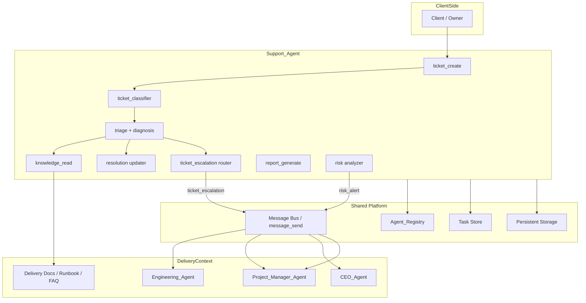
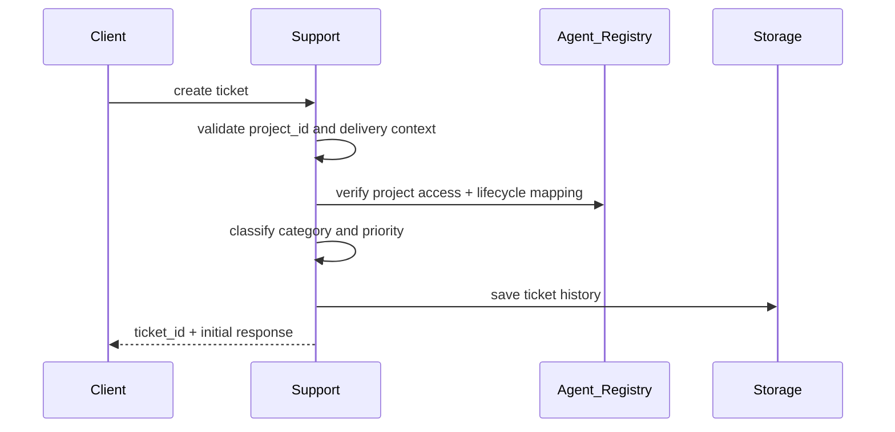
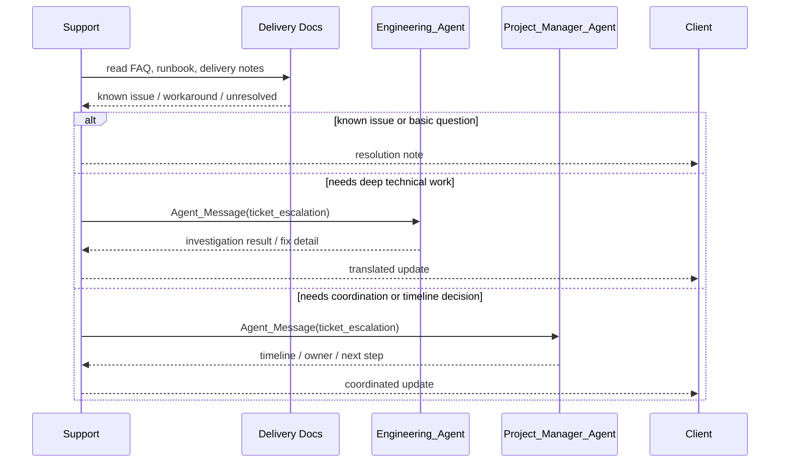
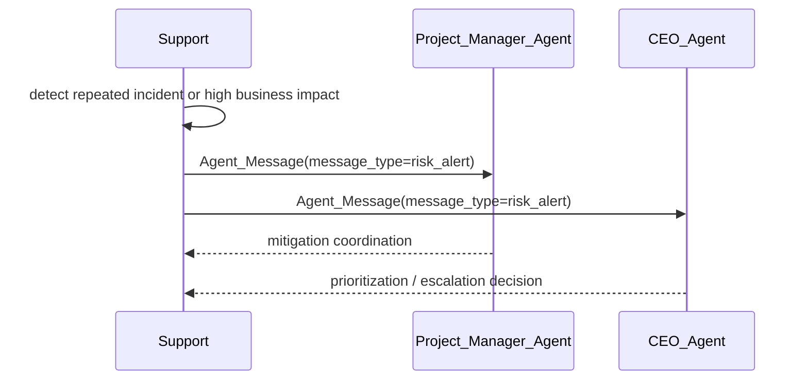

# Design Document

## Support Agent

---

## Overview

Dokumen ini menerjemahkan requirement [support-agent](/home/rny/work/2026/05-mei/agentai01/.kiro/specs/support-agent/requirements.md) ke desain implementasi yang kompatibel dengan spec induk [ai-company-agents](/home/rny/work/2026/05-mei/agentai01/.kiro/specs/ai-company-agents/requirements.md), serta terhubung dengan konteks delivery dari Engineering_Agent dan koordinasi proyek dari [project-manager-agent](/home/rny/work/2026/05-mei/agentai01/.kiro/specs/project-manager-agent/requirements.md).

Support Agent aktif terutama setelah proyek mencapai `Lifecycle_State: delivered` dan berpindah atau dipetakan ke fase `support`. Agent ini berfungsi sebagai lapisan pertama pasca-delivery:

1. menerima dan mengklasifikasikan tiket,
2. menjawab pertanyaan atau troubleshooting dasar menggunakan knowledge delivery,
3. mengeskalasi tiket teknis melalui `ticket_escalation`,
4. mengirim `risk_alert` bila isu menunjukkan pola sistemik, SLA breach, atau risiko lintas proyek,
5. menerjemahkan hasil investigasi agent lain menjadi update yang mudah dipahami klien.

**Prinsip desain utama:**
- support selalu berangkat dari konteks proyek yang sudah delivered, bukan percakapan tanpa state
- tiket harus dapat dilacak dari intake sampai resolusi, termasuk histori eskalasi
- eskalasi ke Engineering_Agent atau Project_Manager_Agent harus membawa konteks lengkap agar tidak mengulang diagnosis dari nol
- `risk_alert` adalah jalur khusus untuk isu berulang, isu severity tinggi, atau pola yang mengancam stabilitas delivery

---

## Architecture

### System Architecture Diagram



### Flow: Post-Delivery Ticket Intake



### Flow: Troubleshooting and Escalation



### Flow: Systemic Issue to Risk Alert



---

## Components and Interfaces

### 1. Ticket Intake Service

Menjadi gerbang utama pembuatan tiket pasca-delivery.

```ts
type TicketIntakeService = {
  createTicket(input: SupportTicketInput): Promise<SupportTicket>
  requestClarification(ticketId: string, questions: string[]): Promise<void>
}
```

**Tanggung jawab:**
- memvalidasi `project_id`, kontak pelapor, dan ringkasan masalah
- memastikan proyek terkait dapat dipetakan ke fase `support`
- membuat `ticket_id` unik dan status awal

### 2. Ticket Classifier

Mengelompokkan tiket dan menetapkan prioritas awal.

```ts
type TicketClassifier = {
  classify(input: SupportTicket): Promise<TicketClassification>
}
```

**Kategori minimum:**
- `question`
- `bug`
- `incident`
- `change_request`

**Priority minimum:**
- `low`
- `medium`
- `high`
- `critical`

### 3. Knowledge Resolver

Mengambil konteks delivery untuk resolusi cepat.

```ts
type KnowledgeResolver = {
  findRelevantContext(projectId: string, query: string): Promise<KnowledgeBundle>
}
```

**Sumber pengetahuan:**
- delivery notes
- runbook operasional
- FAQ proyek
- histori support sebelumnya

### 4. Escalation Router

Menentukan apakah tiket harus naik ke Engineering_Agent atau Project_Manager_Agent.

```ts
type EscalationRouter = {
  escalateToEngineering(input: TicketEscalationPayload): Promise<void>
  escalateToProjectManager(input: TicketEscalationPayload): Promise<void>
}
```

**Aturan eskalasi minimum:**
- ke `Engineering_Agent` untuk bug, incident, atau investigasi teknis mendalam
- ke `Project_Manager_Agent` untuk koordinasi owner, timeline, dependency, atau dampak lintas milestone
- semua eskalasi memakai `message_type: "ticket_escalation"`

### 5. Risk Analyzer

Menganalisis sinyal support yang bisa berubah menjadi masalah sistemik.

```ts
type RiskAnalyzer = {
  evaluate(ticket: SupportTicket, history: SupportTicket[]): Promise<RiskAlert | null>
}
```

**Pemicu `risk_alert` minimum:**
- incident berulang pada proyek yang sama
- pola issue yang muncul di lebih dari satu proyek
- tiket `critical` yang belum teratasi melewati ambang waktu
- eskalasi berulang tanpa resolusi permanen

### 6. Client Update Translator

Mengubah hasil teknis dari agent lain menjadi pesan yang mudah dipahami klien.

```ts
type ClientUpdateTranslator = {
  translateResolution(input: ResolutionDraft): Promise<ClientFacingUpdate>
}
```

---

## Data Contracts

### SupportTicket

```ts
type SupportTicket = {
  ticket_id: string
  project_id: string
  client_contact: string
  summary: string
  category: "question" | "bug" | "incident" | "change_request"
  priority: "low" | "medium" | "high" | "critical"
  status: "open" | "triaged" | "waiting_clarification" | "needs_escalation" | "resolved" | "closed"
  occurred_at?: string
  created_at: string
  updated_at: string
}
```

### ResolutionNote

```ts
type ResolutionNote = {
  ticket_id: string
  actor: "support" | "engineering" | "project_manager"
  note: string
  note_type: "diagnosis" | "workaround" | "resolution" | "client_update"
  created_at: string
}
```

### TicketEscalationPayload

```ts
type TicketEscalationPayload = {
  ticket_id: string
  project_id: string
  summary: string
  category: "bug" | "incident" | "change_request" | "question"
  business_impact: string
  reproduction_steps?: string[]
  attempted_actions: string[]
  conversation_history: string[]
  requested_outcome: string
}
```

### RiskAlert

```ts
type RiskAlert = {
  alert_id: string
  project_id: string
  severity: "medium" | "high" | "critical"
  trigger: "repeat_incident" | "cross_project_pattern" | "sla_breach" | "unresolved_escalation"
  summary: string
  recommended_action: string
  created_at: string
}
```

### Agent_Message Payloads

```ts
type SupportEscalationMessage = {
  from: "support"
  to: "engineering" | "project_manager"
  message_type: "ticket_escalation"
  project_id: string
  timestamp: string
  payload: TicketEscalationPayload
}
```

```ts
type SupportRiskAlertMessage = {
  from: "support"
  to: "ceo" | "project_manager"
  message_type: "risk_alert"
  project_id: string
  timestamp: string
  payload: RiskAlert
}
```

---

## Persistence Model

```text
support/
  tickets/{project_id}/{ticket_id}.json
  tickets/{project_id}/{ticket_id}-conversation.jsonl
  tickets/{project_id}/{ticket_id}-resolution.md
  escalations/{project_id}/{ticket_id}.json
  reports/{yyyy-mm}.md
  alerts/{yyyy-mm}.jsonl
```

Penyimpanan support harus mempertahankan histori utuh agar tiket, eskalasi, dan alert dapat diaudit setelah proyek memasuki fase `support`.

---

## Task Model

Pekerjaan support yang berlangsung asinkron dimodelkan sebagai `Task`.

**Task type minimum:**
- `ticket_triage`
- `knowledge_resolution`
- `ticket_escalation`
- `risk_review`
- `support_report`

**Task lifecycle:**
- `queued`
- `running`
- `waiting_external_agent`
- `waiting_client`
- `completed`
- `failed`

---

## Escalation Rules

### 1. Escalate to Engineering_Agent

Gunakan `ticket_escalation` ke Engineering_Agent bila:
- masalah membutuhkan code fix atau investigasi teknis mendalam
- workaround tidak tersedia di dokumentasi
- incident berdampak langsung ke fungsi inti deliverable

### 2. Escalate to Project_Manager_Agent

Gunakan `ticket_escalation` ke Project_Manager_Agent bila:
- isu membutuhkan keputusan owner proyek, timeline, atau dependency
- change request berpotensi mengubah scope atau komitmen delivery
- incident memerlukan koordinasi lintas agent

### 3. Raise risk_alert

Kirim `risk_alert` ke CEO_Agent atau Project_Manager_Agent bila:
- tiket `critical` melewati SLA
- issue berulang tanpa root cause fix
- satu pola masalah mulai muncul pada banyak tiket atau proyek
- terdapat dampak reputasi, operasional, atau prioritas lintas proyek

---

## Failure Handling

### 1. Missing Delivery Context

Jika Support_Agent tidak menemukan delivery notes atau runbook:
- tiket tetap dibuat
- status awal diubah ke `needs_escalation`
- kirim `ticket_escalation` ke Project_Manager_Agent untuk melengkapi konteks

### 2. Escalation Timeout

Jika agent tujuan tidak memberi respons dalam ambang waktu:
- task diubah ke `waiting_external_agent`
- buat reminder internal
- bila severity tinggi, naikkan `risk_alert`

### 3. Premature Resolution

Tiket tidak boleh ditandai `resolved` hanya karena ada respons dari agent lain. Status `resolved` baru dipakai setelah Support_Agent mengirim jawaban final atau solusi yang dapat ditindaklanjuti klien.

---

## Observability

Support Agent perlu mengirim sinyal ke dashboard induk:

- jumlah tiket terbuka per proyek
- distribusi kategori dan priority
- first response time
- average resolution time
- jumlah `ticket_escalation`
- jumlah `risk_alert`
- daftar tiket `[ACTION REQUIRED]`

---

## Implementation Notes

- Tool inti tetap mengikuti requirement: `ticket_create`, `ticket_update`, `knowledge_read`, `message_send`, dan `report_generate`.
- `ticket_classifier`, `escalation_router`, dan `risk_analyzer` dapat diimplementasikan sebagai service internal yang dipanggil dari workflow tool.
- Desain ini sengaja meletakkan Support_Agent setelah `delivered` dan memodelkan `ticket_escalation` serta `risk_alert` sebagai kontrak eksplisit karena keduanya adalah simpul koordinasi penting pada spec induk.
