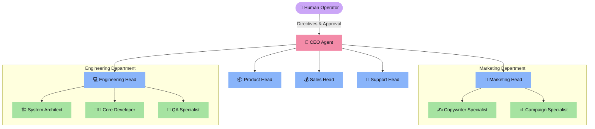

# 🏢 AgentAI01 — AI Company Runtime Platform

[](https://www.typescriptlang.org/)
[](https://bun.sh/)
[](./LICENSE)
[](./docs/agents/08-architecture-and-registries.md)

> **Membangun masa depan orkestrasi kecerdasan buatan multi-agen.**
>
> **AgentAI01** adalah platform runtime production-ready untuk mengorkestrasikan seluruh jaringan agen AI perusahaan ("AI Company") yang terstruktur, aman, dapat diaudit, dan dioperasikan secara real-time melalui web dashboard, messaging channels, dan Terminal UI (TUI).

---

## 🎯 Visi & Misi

Bukan sekadar chatbot atau asisten AI biasa. AgentAI01 dirancang untuk menjalankan operasional perusahaan otonom penuh secara nyata yang dikoordinasikan oleh jaringan agen AI multi-tingkat. Setiap agen memiliki tanggung jawab yang terdefinisi dengan ketat, memori departemen yang terisolasi, dan akses ke `allowedMcpTools` yang terarah.

---

## 🏗️ 4-Tier Agent Hierarchy & Orchestration

AgentAI01 menerapkan struktur organisasi 4 tingkat yang merepresentasikan alur koordinasi perusahaan nyata:



### 🔁 Alur Orkestrasi & Baton Passing
* **Baton Passing**: Pekerjaan dipecah oleh **Department Head** menjadi sekumpulan tugas terpisah yang diselesaikan secara estafet oleh **Specialist Sub-Agents**.
* **Scratchpad Isolation**: Komunikasi internal dilokalisasi dalam `IntraDepartmentScratchpad` untuk menjaga kebersihan bus event utama.
* **Toleransi Kegagalan (SLA & Approval Gates)**: Setiap handoff diverifikasi, dan tindakan berisiko tinggi wajib mendapatkan konfirmasi operator manusia.

---

## ⚡ Fitur Utama

| Fitur | Deskripsi | Tech Stack |
| :--- | :--- | :--- |
| **🕹️ Interactive TUI** | Dashboard terminal real-time untuk memantau job, message, audit log, status kesiapan agen, dan wizard pembuatan agen baru. | Bun + `@clack/prompts` |
| **🌐 REST API Server** | Backend Hono/Express yang melayani status kesiapan (`/health`, `/ready`), manajemen agen, dan pemicu alur kerja. | Bun + `Hono` |
| **🤖 Telegram Channel** | Interface messaging instan terintegrasi untuk memberikan directive langsung dari perangkat mobile Anda. | `grammy` |
| **🔒 Sandboxed MCP** | Setiap Specialist Agent hanya boleh menggunakan subset perkakas yang terdaftar di catalog `allowedMcpTools` miliknya. | `@modelcontextprotocol/sdk` |
| **🛠️ Agent Draft Wizard** | Generator draf agen (manual / AI-assisted) dengan validasi skema runtime yang ketat sebelum diaktifkan. | Zod + Agent Builder |

---

## 🚀 Memulai Cepat (Quick Start)

### 📋 Prasyarat
* [Bun >= 1.2](https://bun.sh) atau [Node.js >= 20](https://nodejs.org/)
* Akses API provider LLM (seperti Anthropic `AI_API_KEY`)

### 🛠️ Langkah Instalasi

1. **Clone repository & Install dependencies:**
   ```bash
   npm install
   ```

2. **Setup Environment Variables:**
   Buat file `.env` di root direktori dengan konfigurasi default:
   ```env
   AI_API_KEY=your-api-key-here
   AI_MODEL=claude-3-5-sonnet
   # Konfigurasi opsional lainnya
   ```

3. **Verifikasi Lingkungan Kerja:**
   Pastikan semuanya berjalan tanpa kesalahan:
   ```bash
   npm run check  # Validasi TypeScript
   bun test       # Jalankan seluruh rangkaian test
   ```

4. **Jalankan Aplikasi Operasional:**
   Pilih salah satu permukaan runtime yang ingin Anda jalankan:

   * **REST API Server:**
     ```bash
     npm run runtime:app
     ```
   * **Terminal UI (TUI):**
     ```bash
     npm run runtime:tui
     ```
   * **Telegram Channel Bot:**
     ```bash
     npm run runtime:telegram
     ```

---

## 🤝 Panduan Kontribusi (Developer Guide)

Kami sangat senang menyambut kontribusi dari komunitas pengembang! Baik Anda ingin meningkatkan efisiensi orkestrasi, menambahkan Specialist Agent baru, memperkuat keamanan sandboxing, atau memperkaya TUI.

### 🗺️ Peta Navigasi Struktur Proyek
Agar Anda tidak tersesat saat pertama kali menjelajahi kode:

* [**`src/domain/`**](./src/domain/) — Kontrak domain utama, tipe TypeScript, transisi siklus hidup, dan definisi tipe MCP.
* [**`src/registry/`**](./src/registry/) — Registri internal yang melacak hubungan hierarki 4 tingkat agen dan sub-agen.
* [**`src/runtime/`**](./src/runtime/) — Mesin orkestrasi utama, baton passing, dan isolasi memori scratchpad.
* [**`src/agents/`**](./src/agents/) — Implementasi Department Heads dan Specialists per sektor.
* [**`src/runtime-app/`**](./src/runtime-app/) — Seluruh antarmuka runtime: server REST API, operator TUI, worker, scheduler, dan telegram bot.
* [**`src/mcp/`**](./src/mcp/) — Inisialisasi, penggabungan konfigurasi non-destruktif, dan bootstrap Model Context Protocol (MCP).

---

### 🎨 Cara Menambahkan Specialist Agent Baru

Untuk berkontribusi agen baru di departemen tertentu, ikuti langkah standar berikut:

#### 1. Buat Definisi Hierarki Agen
Tambahkan deklarasi agen baru di sub-agent registry departemen Anda (misal di `src/agents/subagents/`). Setiap agen wajib memiliki parent:

```typescript
const mySpecialistConfig = {
  agentId: 'timeline-scribe',
  roleType: 'specialist',
  parentAgentId: 'engineering-head', // Menghubungkan ke parent head
  departmentName: 'engineering',
  subAgentIds: [],
  allowedMcpTools: ['slack', 'notion'], // Sangat dibatasi untuk keamanan
  description: 'Specialist untuk mendokumentasikan timeline insiden.',
  color: 'blue'
}
```

#### 2. Implementasikan System Prompt
Tulis prompt instruksi operasional yang spesifik dan teruji di file `.md` atau direktori template agen bersangkutan.

#### 3. Daftarkan di Registri
Pastikan sub-agen baru terdaftar dalam konfigurasi batch inisialisasi di `src/registry/` dan lulus dari pemeriksaan integritas:
```typescript
registry.register(mySpecialistConfig);
const errors = registry.validateIntegrity();
if (errors.length > 0) {
  console.error("Registrasi gagal:", errors);
}
```

#### 4. Buat Unit Test
Selalu sertakan file `.test.ts` pendamping untuk menguji logika unik agen atau batasan alat MCP-nya:
```typescript
import { expect, test } from 'bun:test'
// Uji fungsionalitas dan tool bindings agen
```

---

### 📝 Aturan Kode Penting (CODEX & Security)

Sebelum Anda mengajukan Pull Request (PR), pastikan kontribusi Anda mematuhi standar berikut:
1. **ESM Strict**: Gunakan import relatif dengan menyertakan ekstensi `.js` (misalnya: `import { X } from './utils.js'`).
2. **Strict TypeScript**: Hindari penggunaan tipe `any`. Semua batas eksternal wajib divalidasi dengan Zod.
3. **Audit-Safe Security**: Jangan pernah memasukkan API keys atau kredensial rahasia ke dalam repositori. Simpan sepenuhnya dalam file `.env.local` atau environment runtime.
4. **Verifikasi Hijau (No Broken Tests)**: Pastikan `npm run check` dan `bun test` berjalan sempurna tanpa error tipe atau kegagalan tes sebelum mengajukan PR.

---

## 📚 Dokumen Penting Lainnya

Untuk panduan mendalam tentang topik tertentu:
* 🌟 [VISION.md](./VISION.md) — Filosofi produk dan masa depan platform.
* 💂‍♂️ [AGENTS.md](./AGENTS.md) — Aturan root navigasi dan repo map bagi kontributor.
* 📜 [CODEX.md](./CODEX.md) — Panduan penulisan kode TypeScript strict.
* 🔒 [SECURITY.md](./SECURITY.md) — Kebijakan keamanan, penanganan secret, dan sanitasi.
* 📖 [Docs Index](./docs/README.md) — Katalog dokumentasi detail per topik arsitektur.

---

## 📄 Lisensi

Proyek ini dilisensikan di bawah [**MIT License**](./LICENSE) — silakan gunakan, ubah, dan distribusikan kembali untuk kebutuhan komersial maupun non-komersial Anda secara bebas.

---

<p align="center">
  <b>Mari bersama-sama membangun orkestrasi masa depan! Buka Issue atau ajukan Pull Request hari ini. 🚀</b>
</p>

<p align="center">
  
</p>
